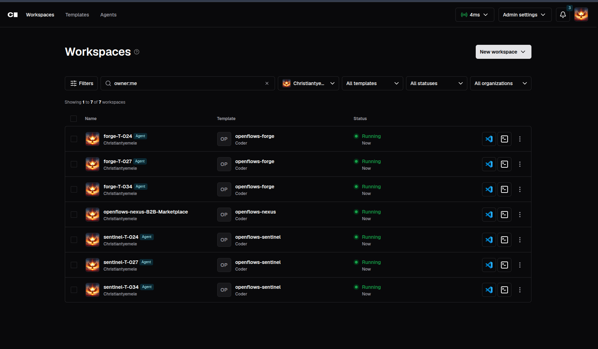

# OpenFlows — Autonomous AI Development Team on Coder


> Official site: [openflows.dev](https://openflows.dev)

**OpenFlows is an autonomous AI software team that turns GitHub issues into reviewed, production-ready pull requests inside your self-hosted Coder environment.** For developers, it handles planning, coding, testing, and adversarial review while keeping them in control of architecture and final decisions. For companies, it brings governed, auditable AI delivery into existing engineering workflows without exposing LLM keys or weakening security boundaries. For stakeholders, it creates a faster, more transparent path from product intent to shipped software.

> **Getting started?** All setup, startup, and troubleshooting steps live in [**quick_start.md**](quick_start.md). The rest of this README is an overview of what the project is, how it works, how far it has come, and what's left.

## Why architecture-first

AI can generate code against a spec, but it can't write the spec. As models make boilerplate cheap, the real difficulty shifts *up the stack* — into architectural thinking, product judgment, and security awareness. OpenFlows encodes that discipline: a declared flow graph (PocketFlow), typed SharedStore state contracts, an explicit routing table, and recovery built into every step. **Engineering goes in, software comes out.** See [`docs/architecture/openflows-system-architecture.md`](docs/architecture/openflows-system-architecture.md) for the full design.

## How It Works

OpenFlows runs a team of AI agents that collaborate just like a real engineering team:

```
You create a GitHub issue → NEXUS picks it up → FORGE writes code → SENTINEL reviews adversarially
→ VESSEL merges green PRs → LORE documents → you get a merged PR
```

You stay in the loop only when needed — security concerns, ambiguous specs, or major decisions. Otherwise, the team runs autonomously, with NEXUS's `reconcile()` detecting orphans, stale workers, and unmerged PRs and recovering automatically.

OpenFlows also enforces a **gated planning checkpoint** — FORGE writes a plan and halts until SENTINEL reviews and approves it before any code is written — and provides **secure, sandboxed A2A verification** so SENTINEL can run acceptance tests against FORGE's workspace without arbitrary code execution. The integration is deliberately asymmetrical: **Coder** governs *where* agents run (governed, ephemeral workspaces with zero AI software and zero LLM keys), while **OpenFlows** governs *how* they coordinate (the flow graph, typed state contracts, and the FORGE↔SENTINEL planning cycle).

## The Team

| Agent | Role | Plan mode | What it does |
|-------|------|-----------|--------------|
| **NEXUS** | Orchestrator | yes | Assigns issues, coordinates the team, owns `reconcile()` failure recovery, notifies you when needed |
| **FORGE** | Builder | no | Writes code against an agreed `CONTRACT.md`, creates branches, opens PRs |
| **SENTINEL** | Reviewer | yes | Adversarially reviews code for security, quality, and test coverage against the contract |
| **VESSEL** | DevOps | no | Monitors CI, handles merge conflicts, squash-merges green PRs, tears down workspaces on merge |
| **LORE** | Writer | no | Documents decisions, updates changelogs, maintains project history *(disabled by default — enable in the registry)* |

## Multi-Tenancy

One Coder server serves many teams. Each tenant = a real Coder user + a repo binding + an `openflows-nexus` workspace. Tenants are isolated by Coder RBAC and per-tenant Redis keyspace prefixes (`ns:{tenant}:...`).

Configure multiple tenants via environment variables or the control plane API (documented in `docs/`).

## Project Status

OpenFlows is an actively developed, functioning system that already ships merged PRs end-to-end. Current state (v1.2.x):

**Working today:**
- A full agent team (NEXUS / FORGE / SENTINEL / VESSEL / LORE) running as Coder Agents on ephemeral, governed workspaces.
- End-to-end flow: GitHub issue → planning gate → FORGE implementation → SENTINEL adversarial review → VESSEL merge → merged PR.
- Gated planning approval with audit-trailed gate records in Redis.
- `reconcile()` failure recovery: orphan / stale worker detection, retry with backoff, and unmerged-PR resume.
- Typed SharedStore contracts and the `openflows worker` CLI as the only Redis client inside workspaces.
- Multi-tenancy via per-tenant Redis keyspace prefixes and Coder RBAC.
- Production controller deployment inside a Nexus workspace (auto-start via startup script).
- A pluggable skill / MCP / model registry.

See [quick_start.md](quick_start.md) to run it, and the planning-gate / architecture docs for the intended end state.

## Plug-and-Play Extension

- **Add a skill**: Drop a directory in `orchestration/plugin/skills/` with a `SKILL.md`, list it in `registry.json` under the role's `skills` array. No code change.
- **Add an MCP server**: Add it to the role's `mcp` object in `registry.json`, or register it centrally in the Coder dashboard (AI Settings → MCP Servers). Both coexist.
- **Enable a new model**: Configure it in the Coder dashboard (AI Settings → Coder Agents → Models). Reference it in `registry.json` via the `model` field.

See [`docs/architecture/openflows-system-architecture.md` §10](docs/architecture/openflows-system-architecture.md) for details.

## Documentation

| Guide | What it covers |
|-------|---------------|
| [quick_start.md](quick_start.md) | Complete setup, startup, and troubleshooting |
| [token_guide.md](token_guide.md) | Token acquisition step-by-step |
| [testing_quick_start.md](testing_quick_start.md) | Testing & debugging walkthrough |
| [docs/architecture/openflows-system-architecture.md](docs/architecture/openflows-system-architecture.md) | Complete system architecture (authoritative) |
| [docs/architecture/openflows-controller.md](docs/architecture/openflows-controller.md) | Controller deep-dive (Subsystem 01) |
| [docs/architecture/openflows-worker-workspace.md](docs/architecture/openflows-worker-workspace.md) | Worker workspaces, bootstrap, and executor setup (Subsystem 03) |
| [docs/architecture/openflows-redis-shared-store.md](docs/architecture/openflows-redis-shared-store.md) | Shared Redis store, tenancy, and namespacing |
| [docs/architecture/openflows-a2a-relay.md](docs/architecture/openflows-a2a-relay.md) | A2A delegated verification protocol and executor sandbox (Subsystem 04) |

## License

MIT
