# Openflows Manager — Database Entity-Relationship Diagram

> Reference schema for the Openflows control-plane PostgreSQL database
> (`crates/openflows-manager/migrations/`). Tables are created by four numbered
> migrations (0001–0004), with constraints and claim tokens added by 0005. This document is **documentation only** — it is not a
> migration and is not applied by `sqlx::migrate!()`.

## Mermaid ER Diagram

```mermaid
erDiagram
    users {
        uuid id PK
        text display_name
        text status
        timestamptz created_at
        timestamptz updated_at
    }
    identities {
        uuid id PK
        uuid user_id FK
        text provider
        text subject
        text login_snapshot
        timestamptz created_at
        timestamptz updated_at
    }
    organizations {
        uuid id PK
        text slug
        text display_name
        uuid owner_user_id FK
        text status
        text coder_organization_id
        timestamptz created_at
        timestamptz updated_at
    }
    memberships {
        uuid organization_id PK,FK
        uuid user_id PK,FK
        text role
        text status
        timestamptz created_at
        timestamptz updated_at
    }
    invitations {
        uuid id PK
        uuid organization_id FK
        bigint invitee_github_user_id
        text role
        text token_hash
        uuid invited_by FK
        timestamptz expires_at
        timestamptz accepted_at
        timestamptz revoked_at
        timestamptz created_at
    }
    sessions {
        uuid id PK
        uuid user_id FK
        text kind
        text access_hash
        timestamptz access_expires_at
        text refresh_hash
        timestamptz refresh_expires_at
        uuid family_id
        timestamptz revoked_at
        timestamptz last_used_at
        timestamptz created_at
    }
    refresh_history {
        text refresh_hash PK
        uuid family_id
        timestamptz consumed_at
        timestamptz expires_at
    }
    auth_transactions {
        uuid id PK
        text purpose
        text state_hash
        uuid user_id FK
        uuid organization_id FK
        bytea pkce_verifier
        timestamptz expires_at
        timestamptz consumed_at
        timestamptz created_at
    }
    cli_login_requests {
        uuid id PK
        text device_secret_hash
        text user_code_hash
        text status
        uuid approved_user_id FK
        timestamptz expires_at
        timestamptz last_poll_at
        timestamptz created_at
    }
    github_connections {
        uuid id PK
        uuid organization_id FK
        bigint app_id
        bigint installation_id
        bigint github_account_id
        text account_type
        text account_login
        text status
        bigint access_generation
        uuid connected_by FK
        timestamptz verified_at
        timestamptz last_reconciled_at
        timestamptz created_at
        timestamptz updated_at
    }
    github_repositories {
        uuid connection_id PK,FK
        bigint github_repository_id PK
        uuid organization_id FK
        text full_name
        boolean accessible
        timestamptz last_seen_at
        timestamptz created_at
        timestamptz updated_at
    }
    github_connect_attempts {
        uuid id PK
        uuid organization_id FK
        uuid initiated_by FK
        text state_hash
        text user_credential_ref
        bigint candidate_installation
        text status
        timestamptz expires_at
        timestamptz consumed_at
        timestamptz created_at
    }
    webhook_deliveries {
        uuid delivery_id PK
        uuid organization_id FK
        text event_type
        text action
        bigint installation_id
        text payload_digest
        bytea payload
        timestamptz received_at
        timestamptz processed_at
        integer attempts
        text lease_owner
        timestamptz lease_expires_at
    }
    credential_leases {
        uuid id PK
        uuid organization_id FK
        uuid tenant_id
        uuid workspace_id
        bigint installation_id
        bigint repository_id
        text permission_profile_hash
        bigint connection_generation
        text token_fingerprint
        text encrypted_ref
        timestamptz expires_at
        timestamptz revoked_at
        timestamptz created_at
    }
    template_releases {
        uuid id PK
        text version
        text manifest_sha256
        text artifact_uri
        text status
        uuid approved_by
        timestamptz approved_at
        timestamptz created_at
    }
    template_release_roles {
        uuid release_id PK,FK
        text role PK
        text archive_digest
        integer parameter_schema_version
        text image_digest
    }
    organization_template_versions {
        uuid id PK
        uuid organization_id FK
        uuid release_id FK
        text role
        text coder_template_id
        text coder_version_id
        text import_job_id
        text status
        text error_code
        timestamptz created_at
        timestamptz updated_at
    }
    organization_provisioners {
        uuid id PK
        uuid organization_id FK
        text backend_resource_id
        text coder_provisioner_ref
        text secret_ref
        text status
        timestamptz last_heartbeat_at
        timestamptz created_at
        timestamptz updated_at
    }
    tenants {
        uuid id PK
        uuid organization_id FK
        text slug
        uuid connection_id FK
        bigint github_repository_id
        uuid pinned_release_id FK
        integer fleet_size
        text desired_state
        text observed_state
        text error_code
        timestamptz created_at
        timestamptz updated_at
    }
    runtime_identities {
        uuid id PK
        uuid tenant_id FK
        uuid organization_id FK
        text coder_owner_id
        text status
        bigint credential_generation
        text secret_ref
        timestamptz created_at
        timestamptz updated_at
    }
    workspaces {
        uuid id PK
        uuid organization_id FK
        uuid tenant_id FK
        text role
        integer slot
        text ticket_id
        text coder_workspace_id
        text pinned_version_id
        text desired_state
        text observed_state
        bigint credential_generation
        timestamptz created_at
        timestamptz updated_at
    }
    runtime_credentials {
        uuid id PK
        uuid workspace_id FK
        text credential_hash
        text audience
        timestamptz expires_at
        timestamptz revoked_at
        bigint generation
        timestamptz created_at
    }
    operations {
        uuid id PK
        uuid organization_id FK
        text resource_type
        uuid resource_id
        text kind
        text idempotency_ref
        text state
        text current_step
        integer attempt_count
        timestamptz retry_at
        text lease_owner
        uuid lease_token
        timestamptz lease_expires_at
        text error_code
        jsonb sanitized_result
        timestamptz created_at
        timestamptz updated_at
    }
    operation_steps {
        uuid operation_id PK,FK
        text step_key PK
        text request_digest
        text upstream_id
        text status
        integer attempt
        jsonb result
    }
    audit_events {
        uuid id PK
        uuid organization_id FK
        text actor_type
        uuid actor_id
        text action
        text resource_type
        uuid resource_id
        text result
        text request_id
        timestamptz occurred_at
    }
    outbox_events {
        uuid id PK
        uuid organization_id FK
        text event_type
        jsonb payload
        integer attempts
        text lease_owner
        uuid lease_token
        timestamptz lease_expires_at
        timestamptz delivered_at
        timestamptz created_at
    }
    idempotency_keys {
        uuid id PK
        uuid actor_id
        uuid organization_id FK
        text route
        text key
        text request_hash
        text response_reference
        timestamptz created_at
        timestamptz expires_at
    }

    users ||--o{ identities : "has"
    users ||--o{ memberships : "belongs to"
    organizations ||--o{ memberships : "has"
    organizations ||--o{ invitations : "sends"
    users ||--o{ invitations : "invited_by"
    users ||--o{ sessions : "owns"
    users ||--o{ refresh_history : "via sessions"
    users ||--o{ auth_transactions : "starts"
    users ||--o{ cli_login_requests : "approves"
    users ||--o{ github_connections : "connected_by"
    organizations ||--o{ github_connections : "owns"
    organizations ||--o{ github_repositories : "scopes"
    github_connections ||--o{ github_repositories : "exposes"
    organizations ||--o{ github_connect_attempts : "scopes"
    users ||--o{ github_connect_attempts : "initiated_by"
    organizations ||--o{ webhook_deliveries : "scopes"
    organizations ||--o{ credential_leases : "scopes"
    template_releases ||--o{ template_release_roles : "contains"
    organizations ||--o{ organization_template_versions : "publishes"
    template_releases ||--o{ organization_template_versions : "referenced by"
    organizations ||--o{ organization_provisioners : "owns"
    organizations ||--o{ tenants : "owns"
    github_connections ||--o{ tenants : "binds"
    template_releases ||--o{ tenants : "pinned_release"
    tenants ||--o| runtime_identities : "has"
    organizations ||--o{ workspaces : "scopes"
    tenants ||--o{ workspaces : "runs"
    workspaces ||--o{ runtime_credentials : "issues"
    organizations ||--o{ operations : "scopes"
    operations ||--o{ operation_steps : "contains"
    organizations ||--o{ audit_events : "scopes"
    organizations ||--o{ outbox_events : "scopes"
    organizations ||--o{ idempotency_keys : "scopes"
    memberships ||--o| organizations : "owner (deferred FK)"
```

## Notes

- **`organizations.owner_user_id`** is a direct FK to `users`, but the
  organization's owner must also have a membership row in that organization,
  enforced by the deferred composite FK
  `organizations_owner_is_member` (migration 0004) referencing
  `memberships(organization_id, user_id)`. This FK does not enforce active
  membership; active-owner policy and concurrency checks belong to WP-02.
- **Composite / deferred FKs:** `workspaces` references `tenants` via a composite
  `(organization_id, tenant_id)` FK so a workspace can never cross organization
  boundaries. `memberships` uses a composite PK `(organization_id, user_id)`.
- **Unique identities:** GitHub numeric IDs are stored as `BIGINT`;
  `identities(provider, subject)` and `github_repositories(connection_id,
  github_repository_id)` are unique; `runtime_identities.coder_owner_id` and
  `workspaces.coder_workspace_id` are unique.
- **Token / credential hygiene:** access and refresh tokens are stored as
  **SHA-256 hashes** (`sessions`, `refresh_history`, `cli_login_requests`,
  `credential_leases.token_fingerprint`, `runtime_credentials.credential_hash`).
  Secrets are returned once or referenced via encrypted `*_ref` fields; raw token
  values are never stored as ordinary application values.
- **Append-only / outbox:** `audit_events` is append-only. `outbox_events` is the
  durable side-effect queue written in the same transaction as the triggering
  state change. `idempotency_keys` makes retries idempotent via
  `UNIQUE (actor_id, organization_id, route, key)`.
- **Leasing:** `operations`, `webhook_deliveries`, and `outbox_events` have
  `lease_owner` and `lease_expires_at`. Operations and outbox claims additionally
  use a fresh `lease_token` per claim to reject stale writes, including when
  the worker name is reused. Operation steps run under their parent operation's
  lease; credential leases track token expiry/revocation, not worker ownership.
- **Migration 0005:** composite FKs enforce repository-to-connection,
  tenant-to-repository, and runtime-identity-to-tenant organization consistency.
  Tenant repository/slug and workspace role/slot uniqueness exclude only rows
  whose desired and observed states are both `deleted`. A NULL workspace slot
  represents a singleton and compares equal to another NULL slot.

## Migration index

| Migration | Domain | Tables created |
|-----------|--------|----------------|
| `0001_identity_and_membership.sql` | Identity & membership | `users`, `identities`, `organizations`, `memberships`, `invitations`, `sessions`, `refresh_history`, `auth_transactions`, `cli_login_requests` |
| `0002_github_integration.sql` | GitHub integration | `github_connections`, `github_repositories`, `github_connect_attempts`, `webhook_deliveries`, `credential_leases` |
| `0003_provisioning_and_runtime.sql` | Provisioning & runtime | `template_releases`, `template_release_roles`, `organization_template_versions`, `organization_provisioners`, `tenants`, `runtime_identities`, `workspaces`, `runtime_credentials`, `operations`, `operation_steps` |
| `0004_shared_audit_outbox_idempotency.sql` | Shared audit / outbox / idempotency | `audit_events`, `outbox_events`, `idempotency_keys` (+ deferred owner FK on `organizations`) |
