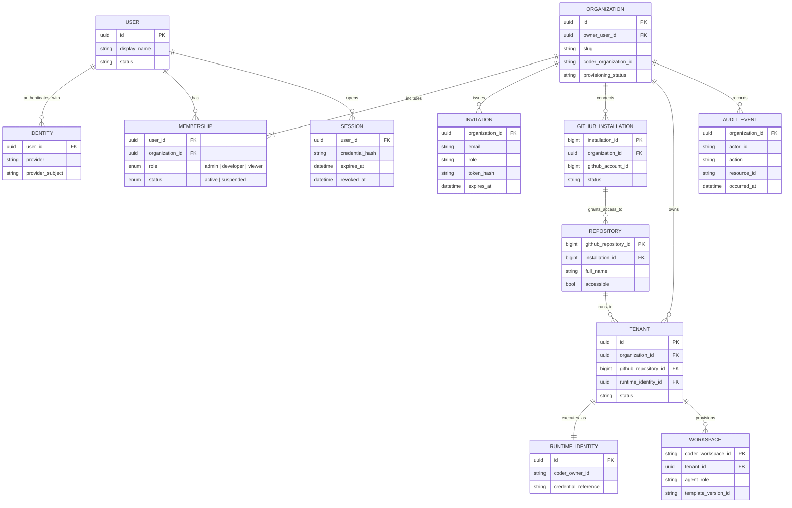
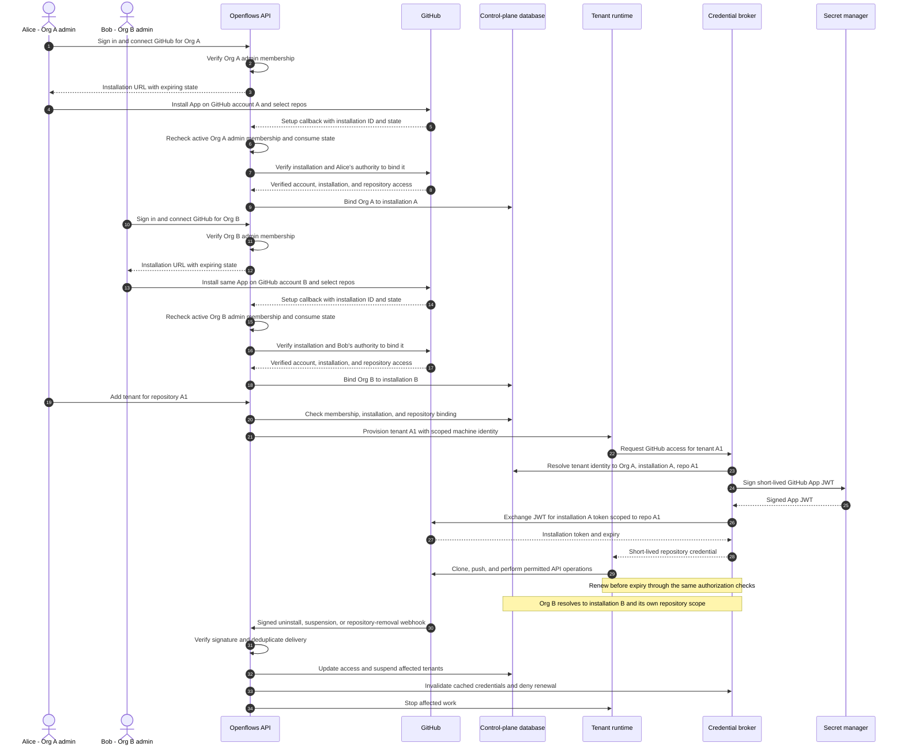

# Centralized Openflows: Identity, GitHub Access, and Deployment Plan

Date: 2026-10-07  
Status: Proposed architecture; not yet implemented

Detailed implementation specifications now live in [the centralized deployment implementation pack](../implementation/centralized-deployment/README.md). Read those documents for API contracts, persistence, role semantics, lifecycle rules, and the model handoff. They supersede ambiguous details in this initial overview, including the owner role: ownership is a separate organization field, while membership roles are admin, developer, and viewer.

## Confirmed deployment decisions

- Use a shared Coder Premium deployment, with one Coder organization per Openflows organization.
- Customers manage Openflows organizations. Coder organizations are infrastructure resources managed by Openflows.
- Openflows stores its own organization ID, membership, product settings, and the corresponding `coder_organization_id`.
- Only an Openflows organization admin may initiate installation, connect an existing installation, or manage the organization's GitHub App connection. Other roles cannot perform these actions.
- GitHub independently requires the installing person to have the necessary authority on the target GitHub account. Openflows admin status does not grant GitHub permissions.

## Goal

Deploy a centrally managed Openflows service where customers sign in, create or join an organization, install the Openflows GitHub App, add repository tenants through the existing CLI, and start building. Openflows provisions the Coder resources and selects approved templates automatically.

Keep human identity, organization membership, and GitHub repository access separate. A user can belong to several Openflows organizations, while each tenant belongs to exactly one organization.

## 1. User management

This is a conceptual model, not a complete database schema. Implementation must add primary keys where omitted, uniqueness constraints, foreign keys, and lifecycle timestamps.

For the first release, bind each GitHub installation to one Openflows organization. An Openflows organization may connect multiple installations. Use immutable GitHub account and repository IDs because names can change.

| Role | Permissions |
|---|---|
| Owner (separate ownership field) | Ownership transfer and organization lifecycle; ownership alone does not authorize GitHub App connection management |
| Admin | Manage members, installations, tenants, and settings |
| Developer | Create and operate tenants using approved repositories |
| Viewer | Read tenant status, runs, and results |

The API must check active membership and role on every request. Selecting an organization in the CLI only selects context; it does not grant access. Runtime identities belong to tenants, so automation does not depend on the continued membership of its creator.

The organization creator initially becomes both owner and admin. Ownership is independent of the admin/developer/viewer membership role, as specified in the detailed implementation pack.

Persist identity, membership, installation bindings, and provisioning records in a durable control-plane database. Redis can continue holding execution state. Enforce that a tenant's repository installation belongs to the same organization as the tenant.

## 2. GitHub App installation and token exchange

One centrally managed Openflows GitHub App has many installations. Installation tokens represent the installed App's access, independently of individual users' login sessions.

### Authorization and credential rules

- Sign-in establishes the human identity; App installation grants repository access; Openflows membership grants management permissions. None substitutes for the others.
- Require the admin role for starting installation, connecting an existing installation, reconnecting, or disconnecting the organization's GitHub App. Enforce this in the API as well as the CLI or UI.
- Recheck active admin membership when processing the callback, before committing the binding. A user who lost admin access after starting installation cannot complete the connection.
- A GitHub installation performed outside Openflows does not automatically connect an Openflows organization. Only an authenticated Openflows admin may claim the installation after the authority checks.
- Developers and viewers use repositories already approved through the organization's connection; they do not perform individual installation or connection flows.
- Bind installation state to the initiating user and organization, expire it, and consume it once. The setup callback alone is not proof of authority.
- Verify the user's authority to connect the installation before persisting the binding. Support connecting an existing installation through the same checks.
- The broker derives installation and repository scope from the authenticated tenant identity. It must never trust a caller-supplied installation ID alone.
- Cache credentials by installation, repository scope, and permission set.
- Keep the App private key in the central service's secret-management boundary. The signing step may use a signing service or trusted backend with secret-manager access.
- Installation tokens expire after one hour. Running workspaces need renewal for Git operations and API calls.
- Validate webhook signatures, deduplicate deliveries, and reconcile installation access periodically to recover from missed events.
- On removal or suspension, deny new credentials, invalidate caches, stop affected work, and revoke outstanding credentials where supported. Cache invalidation alone does not revoke a token already delivered to a runtime.

Reference: [GitHub installation authentication](https://docs.github.com/en/apps/creating-github-apps/authenticating-with-a-github-app/authenticating-as-a-github-app-installation).

## 3. Coder templates and provisioning

Coder hosts the published templates. Git remains the source of truth for template source and release history.

- Publish versioned releases of Nexus, Forge, Sentinel, Vessel, and Lore templates.
- Maintain an organization-specific mapping from agent role to template and approved version IDs.
- Let controllers select approved versions at runtime and pin versions for reproducibility.
- Promote upgrades deliberately and support rollback.
- Reconcile missing resources on startup without publishing new template versions on every restart.

Provision the platform at deployment startup, customer organization resources during onboarding, Nexus when a tenant is added, and workers on demand.

Coder documents additional organizations as a Premium feature. Templates and provisioners are organization-scoped, and additional organizations require dedicated provisioners. With this layout, publish the same source release into each customer's Coder organization.

The selected deployment layout is shared Coder Premium organizations, with a one-to-one mapping from Openflows organization to Coder organization. Openflows is authoritative for product membership and permissions; it provisions necessary Coder access without granting customers deployment-wide Coder ownership. Tenant runtime identities operate workspaces. Human Coder accounts are only needed if direct Coder access is introduced.

References: [Coder organizations](https://coder.com/docs/admin/users/organizations), [Coder templates API](https://coder.com/docs/reference/api/templates). Verify supported APIs and entitlements against the deployed Coder version.

## 4. Intended onboarding experience

1. Sign in to Openflows.
2. Create an organization or accept an invitation.
3. An organization admin installs or connects the Openflows GitHub App. Other members use that approved connection.
4. Select an accessible repository and add a tenant through the existing CLI.
5. Openflows provisions Coder resources and starts Nexus.

The CLI authenticates to the Openflows API. The service performs privileged provisioning and reports progress, failures, and retry status. Customers do not need operator credentials.

## 5. Existing deployment gaps

The initial repository inspection identified these areas:

- **Workspace ownership:** `ensure_tenant()` uses the session user as workspace owner rather than establishing a separate tenant runtime identity.
- **Credential scope:** bootstrap passes the caller's Coder session token into Nexus. A centralized administrator token must not become a customer runtime credential.
- **Organization selection:** default-organization resolution and template lookup by name need explicit organization, template, and version IDs.
- **GitHub access:** current onboarding depends on the session user's Coder external-auth link. Background automation needs installation-bound credentials and renewal.
- **State isolation:** Redis key prefixes organize data but do not enforce access isolation. Credentials and network policies must prevent cross-tenant access.
- **Provisioning durability:** setup needs durable status, retries, locking, and reconciliation across partial failures.

Relevant implementation entry points:

- [Tenant bootstrap and template publishing](../../crates/coder-client/src/bootstrap.rs)
- [Coder organization resolution and workspace creation](../../crates/coder-client/src/lib.rs)
- [Nexus template](../../crates/coder-client/templates/openflows-nexus/main.tf)

## 6. Implementation plan

| Phase | Work | Completion criteria |
|---|---|---|
| **1. Establish the selected deployment layout** | Configure shared Coder Premium with one Coder organization per Openflows organization. Define workspace ownership, provisioners, and infrastructure boundaries. | Documented architecture and configured organization mapping with a two-customer isolation model. |
| **2. Build identity and authorization** | Add users, identities, organizations, memberships, invitations, sessions, and audit records to a durable database. Implement CLI login, organization selection, and server-side role checks. | Users can join multiple organizations; cross-organization requests are denied; revoked memberships lose access. |
| **3. Implement GitHub installation lifecycle** | Add verified installation binding, repository discovery, signed webhooks, credential broker, scoped tokens, and renewal. | Two organizations access only their authorized repositories; removal and uninstall stop affected automation. |
| **4. Make provisioning organization-aware** | Replace default-organization assumptions and name-only template lookup. Introduce tenant runtime identities. Remove caller/admin tokens from Nexus parameters. | Every workspace has a verified organization, tenant, owner, and approved template version. |
| **5. Automate template and infrastructure setup** | Publish versioned templates, record release mappings, provision organization resources, and reconcile setup with durable retries and locking. | Restarting or retrying onboarding creates no duplicates; partial failures resume; template rollback works. |
| **6. Connect the existing CLI** | Route tenant creation through the control-plane API. Add provisioning status, actionable errors, and safe retries. | A new customer can sign in, connect GitHub, add a tenant, and start work without operator credentials. |
| **7. Verify production isolation and operations** | Enforce Redis ACLs or separate instances, network boundaries, secret handling, resource quotas, backups, monitoring, and cleanup. | Isolation tests, token-expiry tests, recovery tests, and a complete onboarding run pass. |

## 7. Deployment acceptance gate

Before public deployment, two independent organizations must be able to onboard, run agents, renew credentials, and revoke access without accessing each other's repositories, workspaces, state, or secrets.

Verification must cover:

- Cross-organization resource IDs and forged organization/installation parameters.
- Membership revocation and role changes during active CLI sessions.
- Denial of GitHub connection management to non-admins, including direct API calls and callbacks after admin access is revoked.
- GitHub token expiry during long-running work and renewal after access removal.
- App suspension, uninstall, repository removal, and duplicate webhook deliveries.
- Provisioning interruption, concurrent retries, restart recovery, and template rollback.
- Tenant runtime credential scope and inability to obtain operator credentials.
- Redis and network isolation between tenants.
- Backup restoration and cleanup of partially provisioned resources.
