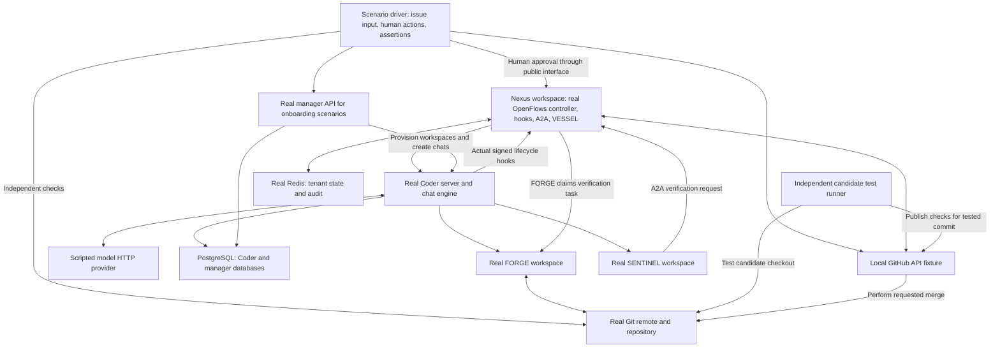

# OpenFlows End to End Testing Architecture

The goal is to prove that a new OpenFlows build can take an issue, provision agents, produce a correct change, verify the exact commit, obtain the required approvals, merge that change, and clean up. A passing test must include independent evidence of the resulting code and repository history. An agent saying it completed the task is insufficient.

This is the target architecture. PRs #400, #401, and #403 implement its first three increments; the complete issue-to-merge suite remains to be built. Tests reduce regression risk for the scenarios they cover; they cannot guarantee that every possible change is safe.

## What the existing pull requests do

| Pull request | Purpose | What it proves | What it does not prove |
| --- | --- | --- | --- |
| [#400](https://github.com/The-AgenticFlow/openflows/pull/400) | Establish the CI merge gate and real service tests | Real Redis and PostgreSQL integration; Coder provisions a workspace; planning gates, tenant separation, restart, and deletion work; every mandatory CI job must succeed | The controller can take an issue through agent chats to a merged PR |
| [#401](https://github.com/The-AgenticFlow/openflows/pull/401) | Verify acceptance through separate real workspaces | SENTINEL requests tests over A2A; FORGE executes them outside its original checkout; failing tests cannot authorize submit; head and round checks reject stale approvals | Model-driven dispatch, controller issue routing, Coder hooks, GitHub integration, human PR approval, or an actual merge |

#401 is based on #400. They are pull requests containing test infrastructure and coverage, rather than the test issues that agents will solve. Their checks remain useful when the complete system suite is added: they isolate failures and run focused cases that would be expensive to repeat through the whole workflow.

## The test layers

| Layer | Environment | When it runs | Status |
| --- | --- | --- | --- |
| Build and unit tests | Rust workspace | Every PR and merge candidate | Existing |
| Service integration | Real Redis and PostgreSQL | Every PR and merge candidate | Covered by #400 and existing manager tests |
| Worker integration | Real Coder, Terraform, SSH, workers, Redis, A2A | Every PR and merge candidate | Covered in part by #400 and #401 |
| Complete deterministic system E2E | Real OpenFlows and Coder; local GitHub and model fixtures; real Git | Every PR and merge candidate once established | Next implementation |
| Live external E2E | Production templates, linked GitHub authentication, disposable GitHub repo, real model provider | Nightly and before release | Future implementation |
| Manager and onboarding E2E | Manager HTTP API, PostgreSQL, tenant configuration, Coder; browser journey where applicable | Relevant PRs initially; mandatory once stable | Future implementation; current manager integration is a foundation |

The deterministic system suite provides repeatable merge decisions without external credentials. The live suite checks the external contracts, credentials, templates, and model behavior that local fixtures cannot establish. A required live release check must actually run and pass for that candidate; missing credentials cannot silently turn it into a passing skipped job.

## Complete deterministic system topology

Each run creates a fresh Docker network and disposable resources. Coder creates the Nexus and worker workspaces. The controller inside the Nexus workspace runs the production flow graph, including NEXUS scheduling and VESSEL merge handling, and hosts the hook consumer and A2A relay.

The manager participates in onboarding scenarios. A controller scenario may begin with an already configured disposable tenant, so a manager failure and a controller failure can be diagnosed separately. The complete product journey combines onboarding with issue processing after those individual journeys pass.

## What is real and what is controlled

| Component | Test behavior |
| --- | --- |
| OpenFlows | Build from the candidate commit; run the actual controller, role routing, harness, hooks, A2A, and VESSEL code |
| Coder | Pinned real server, PostgreSQL, Terraform provisioning, chat engine, command execution, and workspace lifecycle |
| Worker commands | Actually edit files, commit changes, run tests, request verification, and record reviews |
| Redis and PostgreSQL | Real servers and normal migrations; isolated tenant data and databases |
| Git repository | Real commits, branches, remote pushes, and merge operations |
| Model provider | Local HTTP fixture returning scripted text and tool calls; Coder must execute those calls in real workers |
| GitHub service | Local HTTP fixture implementing the required issue, PR, review, check, and merge endpoints; merge requests operate on the real Git repository |
| Candidate CI | Real acceptance commands run independently against the requested candidate; check status belongs to that commit |
| Human | Scenario driver performs the human approval through the supported CLI or API, including revision, round, and head |

The model fixture controls the agent's choices, not the results of its commands. It cannot write successful verification records, approve gates through Redis, or declare a merge complete. Unexpected tool schemas and unsupported GitHub requests fail with diagnostics rather than receiving generic success responses.

The GitHub fixture is a deliberately limited adapter, not a complete GitHub implementation. Its expected behavior must be checked against the live suite. Production GitHub external authentication and OAuth linking are separate live-test responsibilities; injecting a disposable fixture token does not prove that linking works.

## The first complete scenario

Use a small repository with a committed acceptance test and a known failing implementation. For example, an addition function returns the wrong result, and the independent acceptance test requires `add(19, 23)` to return `42`. The acceptance oracle is fixed by the scenario, independently of model responses.

1. The driver creates an issue through the GitHub fixture. NEXUS discovers it through the normal issue polling path.
2. NEXUS provisions FORGE and starts a real Coder chat. The scripted model inspects the repository and uses real tools to write and submit a plan.
3. The controller starts SENTINEL plan review. SENTINEL approves the current plan revision and round through the harness. FORGE cannot implement before that approval.
4. FORGE edits the implementation, commits, and enters testing with a clean candidate checkout.
5. SENTINEL requests acceptance verification through A2A. FORGE executes the command in a temporary checkout of the recorded head. The result must report the correct commit, executor, working directory, exit code, and output.
6. SENTINEL approves testing for that exact candidate. FORGE enters submit, pushes the branch to the real local remote, creates a PR through the fixture, and records it through the harness.
7. SENTINEL reviews the PR, and OpenFlows delivers the review through its normal GitHub path. The independent CI runner tests the PR head and publishes its check result.
8. Without human PR approval, VESSEL must leave the PR unmerged. The driver then approves the exact candidate through the public operator interface.
9. VESSEL requests the merge. The fixture checks the requested head against the current PR head and performs the configured Git merge operation.
10. The driver independently checks the resulting default branch, reruns the acceptance test, checks the commit relationship appropriate to the merge method, confirms lifecycle completion through the public interface, and confirms workspace cleanup.

Human PR approval is part of this scenario. Human testing approval is currently deferred in the lifecycle implementation and must not be presented as an existing required gate. The test should follow the current contract and change when that contract changes.

The driver may configure initial accounts and fixtures, create issues, perform human decisions, observe public interfaces, and inject declared failures. Agents and the controller must perform the remaining workflow. Directly writing lifecycle transitions or success outcomes to Redis would bypass the behavior this complete scenario is meant to test.

## Required failure scenarios

Add these after the first complete scenario works, one scenario at a time.

| Failure | Required outcome |
| --- | --- |
| Plan rejected | FORGE receives feedback; implementation stays gated until a revised plan is approved |
| Acceptance fails | No successful verification evidence or testing approval; FORGE can repair and obtain fresh verification |
| PR head changes after verification or approval | Previous evidence cannot authorize the changed candidate; fresh review and verification are required |
| Current round with old head; old round with current head | Each stale identity is independently rejected |
| Missing, failed, or pending CI | No premature merge; a pending check is not success |
| Human approval absent or rejected | No merge; rejection is reflected in the workflow |
| Repeated polling, duplicated hooks, or repeated delivery | No duplicate assignment, workspace, review, or merge side effect |
| Worker or controller restart | Reconciliation preserves the candidate and required approvals without bypassing gates |
| Merge response lost after remote merge | Reconciliation detects the actual remote result without producing a second merge |
| Invalid hook signature or wrong A2A pair token | Request is rejected; lifecycle does not advance |
| Concurrent tenants | Tickets, credentials, verification, and approvals stay within their tenant |

Existing focused tests cover parts of these cases. Full system scenarios verify that the controller and transports preserve the same rules when combined.

## CI enforcement and diagnostics

Retain the existing focused jobs. Add a distinct required system E2E job to the final `OpenFlows Merge Gate` when the first complete scenario passes consistently. Run it against the candidate commit and the merge-queue candidate where a queue is configured. The final gate must reject failed, cancelled, timed-out, and skipped mandatory jobs.

Every run uses pinned dependencies, bounded startup and scenario deadlines, readiness checks, unique resource names, disposable credentials, and cleanup restricted to its own resources. CI scenarios must not load operator configuration or production volumes. Cleanup runs on success, failure, and cancellation.

Save correlated controller logs, Coder logs and chat tool results, authenticated hook event metadata, A2A results, candidate CI output, GitHub fixture requests, repository refs, approval identities, and the final acceptance result. Remove credentials from diagnostics. A green run must include positive evidence that the required hooks, verification, approval, and merge steps occurred; silence from a fail-open dependency is insufficient.

Do not hide intermittent failures with blanket reruns. Report startup failures separately from assertion failures, then repair the cause or keep the affected gate failing.

## Delivery order and completion criteria

1. Merge #400 to establish the required checks and disposable service infrastructure.
2. Merge #401 after #400, updating its base to the intended protected branch as needed. This adds the real delegated-verification boundary.
3. Build the local GitHub adapter, real Git remote, independent CI runner, and scripted model provider around one complete scenario.
4. Run the production controller in the Nexus workspace and prove actual Coder chat execution and signed hooks. Complete the issue-to-merge scenario and make its CI job mandatory.
5. Add recovery, rework, approval, and tenant-isolation scenarios; add the manager onboarding journey through its public interfaces.
6. Add the credentialed live suite against a disposable GitHub repository and real provider, using production templates and linked authentication. Establish nightly monitoring and a release check for the candidate being released.

The full deterministic E2E milestone is complete only when an issue submitted through the public boundary reaches a genuinely merged Git commit through the actual controller and agent paths, independently passes acceptance, respects every required gate, and leaves the expected cleanup state. The live milestone additionally proves the production authentication, external services, and templates. Passing #400 and #401 alone does not satisfy either milestone.

## Task 3 infrastructure

The [system fixtures](../../tests/e2e/system/README.md) implement the local scripted model provider, limited GitHub API adapter, real Git remote, and independent exact-commit acceptance runner. Their mandatory contract job checks the production OpenFlows GitHub client and verifies actual acceptance failure, stale evidence rejection, and Git merging. The model contract checks normal and streamed tool responses and matching tool results.

This is delivery step 3 infrastructure, not the complete system milestone. The production controller, real Coder chats and signed hooks, public human approval, and workspace cleanup across the complete journey remain delivery step 4. The fixture contract driver deliberately controls Git/API calls and must not be presented as proof that agents or the controller performed them.

## Production bootstrap coverage

The first step 4 scenario runs the public tenant CLI against a fresh Coder deployment. It uploads all five production Terraform templates, provisions Nexus, clones the real fixture repository, checks the Rust controller's health, and makes a real Coder chat execute a workspace command. It also checks that unchanged bootstrap reuses template versions, changed Terraform settings produce new versions, and workspace deletion succeeds. Logs are collected before deletion.

This check catches regressions in fresh tenant configuration, template upload and configuration forwarding, Nexus startup, repository cloning, and Coder command execution. It does not yet prove issue discovery, FORGE/SENTINEL chats, signed hook delivery, human approval, or VESSEL merging. Those remain the next part of delivery step 4.

## Implementation references

- [Current container suites](../../tests/e2e/README.md)
- [CI workflow](../../.github/workflows/ci.yml)
- [Controller entrypoint and routing](../../binary/src/bin/agentflow.rs)
- [Ticket lifecycle and approval contract](../../crates/config/src/lifecycle.rs)
- [Delegated verification test](../../binary/tests/delegated_verify_e2e.rs)
- [System architecture](openflows-system-architecture.md)
