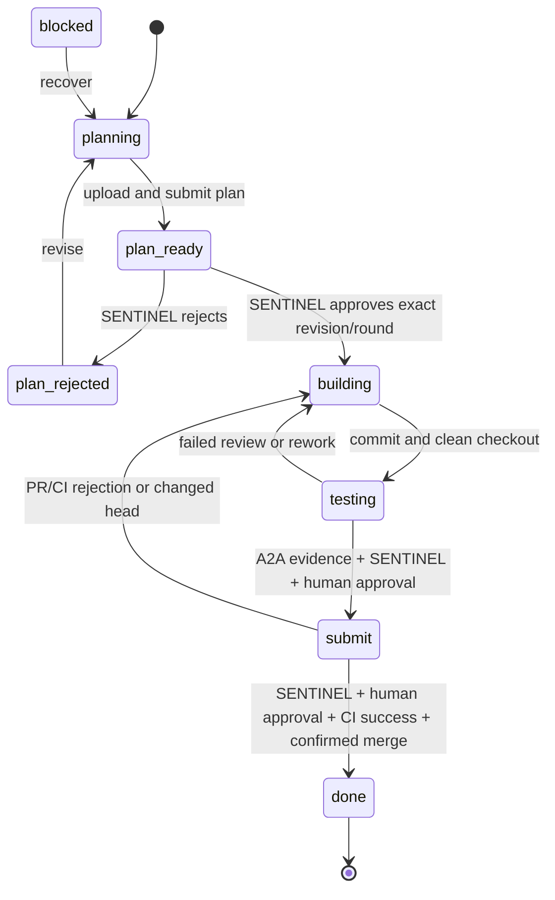

# OpenFlows ticket lifecycle

The authoritative record is `ns:{tenant}:ticket:{id}:status`. It is a versioned
JSON object owned by the lifecycle reducer in `config::lifecycle`. Controllers
and the harness use `SharedStore::transition`, which validates the event and
atomically compares/replaces the complete record. A conflict requires a fresh
read; Redis errors are returned, never reported as successful transitions.



Any nonterminal stage can report `blocked` unless a merge is being reconciled. Done is terminal. Returning to planning requires
uploading a new plan; returning to building invalidates testing and PR evidence.
Every transition records actor, time, version, previous/next phase and detail in
history. Operational worker allocation and ticket scheduling remain projections.

## Worker commands

```sh
openflows-harness status get
openflows-harness status set planning
openflows-harness plan write --file PLAN.md
openflows-harness status set plan_ready
```

SENTINEL reads the plan and records its exact `revision` and `review_round`:

```sh
openflows-harness gate decide --phase plan_ready --revision 1 --round 1 \
  --verdict approve --report review.md
```

Reject uses the same command with `--verdict reject`. FORGE reads the feedback,
returns to planning, revises/uploads, and resubmits. After approval FORGE enters
building. After committing all work it enters testing with a clean checkout and
runs `openflows-harness verify serve` so SENTINEL can request verification:

```sh
openflows-harness verify request --expect-exit 0 -- cargo test
openflows-harness gate decide --phase testing --revision 1 --round 2 \
  --head <tested-commit> --verdict approve --report review.md
```

Put harness options before `--` and the executable plus its arguments after it.
Do not quote the entire command: `--argv "cargo test"` is one token, not the
executable `cargo` followed by `test`. The legacy token form remains supported:
`--argv cargo --argv test --argv=--workspace --argv=--all-features`.
Tokenization errors should be corrected and retried. Unfamiliar project tooling is
allowed in a temporary verification checkout; explicit destructive
and control-plane operations are denied. See [verification checkout](verification-sandbox.md)
for checkout preparation, artifact collection, and execution permissions.

The executor reports a clean checkout head before and after execution. Missing,
changed, dirty or timed-out evidence cannot satisfy the gate. SENTINEL must
review implementation against the plan as well as test results.

## Human gates

Human approval is required at both testing and submit. An operator reads the
current state using `openflows gate status --tenant <tenant> --ticket <ticket>
--phase testing`, reviews its evidence, and records a decision:

```sh
openflows gate decide --tenant <tenant> --ticket <ticket> --phase testing \
  --revision <N> --round <R> --head <SHA> --verdict approve --notes "Reviewed test evidence"
```

After testing approval, FORGE sets submit, opens/updates the PR, and records it
with `pr opened`. Recording a different PR advances the review round. Read
status again before PR review. SENTINEL uses:

```sh
openflows-harness review submit --revision <N> --round <R> --head <SHA> \
  --verdict approve --report final-review.md
```

The human repeats the operator decision for `--phase submit`. These are trusted
operator/worker commands within the existing Redis credential boundary; this
change does not add an authentication service or treat environment role strings
as cryptographic identity. GitHub-only approval does not replace these gates.

## Merge and recovery

PR decisions and pending GitHub delivery are written in one lifecycle update.
SENTINEL retries delivery and acknowledges it atomically. Each queued delivery
binds the original PR number, revision, head and round. Approval delivery waits
for the human gate. Human rejection and PR replacement cancel obsolete queued
approval. Rejection immediately returns work to building; a new phase supersedes
old queued delivery, so a GitHub outage cannot block retesting. Reports remain in
history. Pending current approval delivery prevents merge. A crash may repeat a
GitHub review, but cannot erase its durable decision.

VESSEL checks the current head, all observed CI sources, persisted agent/human
approvals, and completed review delivery. Empty CI, timeouts, unknown results,
pending checks or failures cannot authorize a merge. GitHub receives the
expected head SHA. A persisted merge reservation prevents concurrent rejection
or rework while that request is in flight.

A definitive rejected merge response releases its reservation. Merge requests
are not automatically retried after an ambiguous response. An unknown network
outcome retains its reservation. VESSEL reconciles a confirmed
GitHub merge to done, recording GitHub's actual merge commit. An unmerged snapshot
alone never releases a reservation: the earlier request might still be running.
An unresolved reservation requires operator investigation; no unsafe automatic
retry/unlock is provided. Restart reconciliation also records externally merged
PRs explicitly, without claiming they passed the automated gates.

## Upgrade

Deploy controller and worker harness/instructions together. Existing on-disk
bundled instructions may require `openflows --reset-orchestration` when updating.
No deployment or reset is performed by this change.

Legacy scalar/object active statuses are decoded conservatively as planning;
old gate keys do not authorize work. For an active legacy ticket, explicitly run
`status set planning`, re-upload its plan, and complete new review. Legacy merged
statuses stay terminal. `plan read` can still read legacy raw Markdown, while
new plan content is authoritative in the lifecycle with a JSON compatibility
projection. `review_ready` and unversioned `gate approve` are intentionally
rejected with migration guidance.

## Verification

Run `cargo test --workspace --all-targets --all-features` and the repository lint
checks. `bash tests/integration/gated_workflow_test.sh` starts a disposable Redis,
checks a real plan round trip, races two review updates, and injects OOM to verify
that failed writes leave lifecycle/approvals unchanged. It destroys its test
container on exit and must not target a production Redis.

Ticketless discovered PRs receive an explicit unmanaged/manual outcome and are
removed from the automated queue. Discovery skips them until they are linked to
a ticket; it does not bypass the lifecycle gates. PR review chats use the exact
revision, head and round, so stale chats cannot suppress a fresh review.

Before rotating a PR reviewer, NEXUS interrupts any running old chat, confirms
it is no longer running, and archives it before deleting bindings or freeing
the slot. A still-running chat or Coder API failure retains the binding and
slot for retry on the next controller poll.

### Verification execution

FORGE runs verification in a temporary detached checkout of the clean candidate
commit, using its existing tools, environment, dependency caches, and network.
No verification image or Docker engine is required. The checkout has an independent
Git index and object database and is removed after execution. Generated artifacts
are collected before cleanup. Edits to committed source invalidate commit evidence.
This provides checkout separation, not a security boundary for untrusted processes.

When a SENTINEL workspace is replaced, NEXUS interrupts an active old reviewer,
confirms it has stopped, and archives that conversation before creating a review
session in the new workspace. Interrupt, status, or archive failures preserve the
binding for retry. The
new review receives the current review request and uses durable lifecycle evidence.
Verification enqueue and expiration share a lock order so concurrent retries of
terminal tasks produce only one pending replacement.
