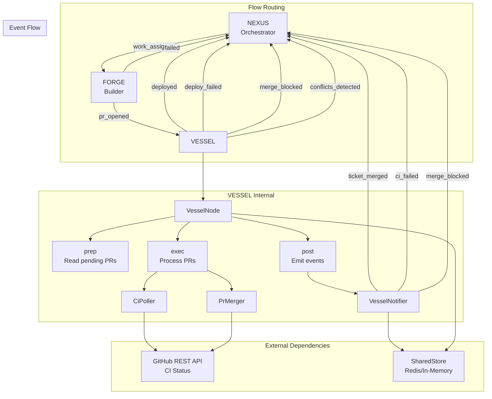

# VESSEL Agent Architecture

## Overview

VESSEL is the DevOps Specialist and Merge Gatekeeper of the autonomous team. It is the only agent authorized to perform destructive or irreversible actions on the production codebase (merging and deploying).

## Design Principles

1. **Modularity** — Each concern (CI polling, merging, notification) is isolated in its own module
2. **Separation of Concerns** — Node orchestrates, components do the work
3. **Reusability** — CI poller and merger can be used by other agents
4. **Clear Naming** — Types and functions use descriptive names
5. **Shared Types** — Common types live in `pocketflow-core/src/types.rs`

## Architecture Diagram



## Module Structure

```
crates/agent-vessel/
├── src/
│   ├── lib.rs              # Re-exports
│   ├── types.rs            # VesselConfig, VesselOutcome, CiReadiness
│   ├── node.rs             # VesselNode (Node trait impl)
│   ├── ci_poller.rs        # CI status polling with early conflict detection
│   ├── conflict_resolver.rs # Auto-resolution attempt (GitHub update-branch / local rebase)
│   ├── merger.rs           # PR merge execution
│   └── notifier.rs         # Event emission
└── Cargo.toml
```

## Component Responsibilities

### VesselNode (`node.rs`)

The orchestrator that implements the `Node` trait. It coordinates the three-phase lifecycle:

| Phase | Method | Responsibility |
|-------|--------|----------------|
| 1 | `prep()` | Read `pending_prs` from SharedStore |
| 2 | `exec()` | Poll CI, merge if green, return outcomes |
| 3 | `post()` | Emit events, update tickets, return action |

### CiPoller (`ci_poller.rs`)

Polls GitHub API for CI status until terminal state. Includes early conflict detection: every 3rd poll attempt, re-fetches the PR from GitHub and checks `mergeable`. If `mergeable == Some(false)`, short-circuits the poll and returns `CiPollResult::Conflicts`.

```
┌─────────────────────────────────────────────────────────────┐
│                    CI Polling Flow                          │
├─────────────────────────────────────────────────────────────┤
│                                                             │
│  get_ci_status(owner, repo, sha)                           │
│         │                                                   │
│         ▼                                                   │
│  ┌─────────────┐                                           │
│  │   Pending?  │──Yes──► Sleep(10s) ──► Retry (max 60)    │
│  └─────────────┘                    │                       │
│         │ No                        ▼                       │
│         ▼                   ┌─────────────┐                 │
│  ┌─────────────┐            │   Timeout?  │──Yes──► Timeout│
│  └─────────────┘            └─────────────┘                │
│         │                           │ No                    │
│         │   Every 3rd attempt:      │                       │
│         │   check mergeable ────────┤                       │
│         │                           │                       │
│         ▼                           ▼                       │
│  Terminal:               Loop back to start                 │
│  Success / Failure / Error / Conflicts                     │
│                                                             │
│  If mergeable == Some(false) -> early return Conflicts     │
│                                                             │
└─────────────────────────────────────────────────────────────┘
```

**Configuration:**
- `interval_secs`: 10 (default)
- `max_attempts`: 60 (10 minutes total timeout)
- `mergeable_check_interval`: 3 (re-check mergeability every 3rd attempt)

### ConflictResolver (`conflict_resolver.rs`)

Only used for `abort_rebase()` cleanup — aborts any in-progress rebase in the worktree before VESSEL runs `git merge origin/main`. The main conflict resolution is now handled by FORGE, not by VESSEL.

### PrMerger (`merger.rs`)

Executes PR merge via GitHub API.

**Commit Message Format:**
```
Merge PR #123: Ticket title (Resolves T-456)
```

**Merge Methods:**
- `Squash` (default) — Clean history, single commit
- `Merge` — Preserve all commits
- `Rebase` — Linear history

### VesselNotifier (`notifier.rs`)

Emits events to SharedStore for dependency resolution.

**Events:**

| Event | Trigger | Payload |
|-------|---------|---------|
| `ticket_merged` | Successful merge | `{ ticket_id, pr_number, sha }` |
| `ci_failed` | CI failure | `{ ticket_id, pr_number, reason }` |
| `merge_blocked` | Merge conflict | `{ ticket_id, pr_number, reason }` |
| `ci_timeout` | Polling timeout | `{ ticket_id, pr_number }` |
| `conflicts_detected` | Unresolvable merge conflicts | `{ ticket_id, pr_number, conflicted_files }` |
| `ci_missing` | No CI workflows | `{ ticket_id, pr_number }` |

**Store Keys:**
- `ticket:{ticket_id}:status` → `"Merged"`
- `pending_prs` → Updated to remove merged PR

## Integration Points

### GitHub REST API (`crates/github/src/rest.rs`)

Direct REST API client for low-latency operations:

```rust
GithubRestClient
├── get_ci_status()           // Combined status + check suites
├── get_pull_request()        // PR details with head SHA
├── merge_pull_request()      // Execute merge
└── is_pr_merged()            // Reconciliation check
```

### Shared Types (`crates/pocketflow-core/src/types.rs`)

Types shared across agents:

```rust
CiStatus      // Pending, Success, Failure, Error
CiPollConfig  // interval_secs, max_attempts
MergeMethod   // Merge, Squash, Rebase
MergeResult   // merged, sha, message
PrInfo        // number, head_sha, head_branch, ticket_id, state
```

### Config (`crates/config/src/state.rs`)

State types and constants:

```rust
TicketStatus::Merged { worker_id, pr_number }  // New variant
KEY_PENDING_PRS                                // Renamed from KEY_OPEN_PRS
ACTION_DEPLOYED, ACTION_DEPLOY_FAILED          // VESSEL action constants
```

## Startup Reconciliation

If VESSEL crashes after merging but before emitting `ticket_merged`, the system might stall (dependency bug). The `reconcile()` method addresses this:

```
┌─────────────────────────────────────────────────────────────┐
│                  Reconciliation Flow                        │
├─────────────────────────────────────────────────────────────┤
│                                                             │
│  On startup:                                                │
│  1. Read pending_prs from SharedStore                      │
│  2. For each PR:                                           │
│     └─► Call is_pr_merged() on GitHub API                  │
│         └─► If merged:                                     │
│             ├─► Emit ticket_merged event retroactively     │
│             ├─► Set ticket status to Merged                │
│             └─► Remove from pending_prs                    │
│                                                             │
└─────────────────────────────────────────────────────────────┘
```

## Error Handling

| Error Type | Action | Store Effects | Flow Route |
|------------|--------|----------------|------------|
| CI Failure | Emit `ci_failed` | ticket -> Failed, PR removed from pending_prs | `nexus` (deploy_failed) |
| CI Timeout | Emit `ci_timeout` | ticket -> Failed, PR removed from pending_prs | `nexus` (deploy_failed) |
| Merge Conflict | Emit `conflicts_detected`, write CONFLICT_RESOLUTION.md | worker Done -> Assigned, PR stays in pending_prs | `forge_pair` (conflicts_detected) |
| Merge Blocked | Emit `merge_blocked` | ticket -> Failed, PR removed from pending_prs | `nexus` (deploy_failed) |
| API Error | Log and skip PR | None | Continue to next PR |

## Rate Limit Mitigation

- Uses ETag/If-Modified-Since headers (future enhancement)
- 10-second polling interval reduces API calls
- Graceful handling of 403 responses

## Testing Strategy

1. **Unit Tests** — Mock GitHub API responses
2. **Integration Tests** — In-memory SharedStore, mock HTTP
3. **E2E Tests** — Full flow with `real_test.rs`

## Future Enhancements

1. **Deployment Phase** — Trigger deployment after merge
2. **Rollback** — Auto-rollback on deployment failure
3. **Health Checks** — Verify deployment health
4. **ETag Support** — Reduce rate limit risk
