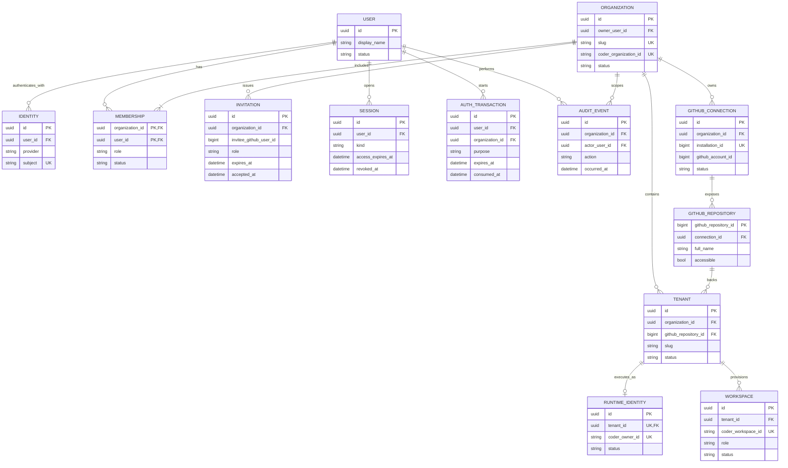

# User management specification

Depends on [shared decisions and API conventions](README.md).

## 1. Identity and ownership

A human has one Openflows user ID and one or more external identities. For v1, GitHub's immutable numeric user ID is the provider subject. Never merge users by display name, login, or email. Organization membership is explicit and never inferred from GitHub organization membership.

Ownership and administration are separate. `owner_user_id` identifies the person authorized to transfer ownership or request organization deletion. An owner must remain an active member. The creator initially has the admin membership. An owner whose role is later changed cannot connect GitHub unless promoted back to admin through normal permissions.

## 1.1 Entity relationships

This diagram shows the product ownership relationships. Coder organizations, GitHub installations, tenants, and workspaces are linked to an Openflows organization, while human users remain independent and may belong to multiple organizations.

`owner_user_id` is a separate ownership field. It must reference an active membership, but it is not a membership role. `GITHUB_CONNECTION` is the detailed specification's name for the GitHub installation binding. Composite organization checks must ensure that a tenant's repository, runtime identity, and workspace cannot be attached across organization boundaries.

## 2. Database migrations

Implement these tables with foreign keys and indexes. UUID primary keys are server-generated unless stated otherwise.

| Table | Required fields and constraints |
|---|---|
| `users` | `id`, `display_name`, `status(active,suspended,deleted)` |
| `identities` | `id`, `user_id`, `provider`, `subject`, `login_snapshot`; UNIQUE(provider, subject) |
| `organizations` | `id`, `slug`, `display_name`, `owner_user_id`, `status(provisioning,ready,suspended,deleting,deleted)`, nullable `coder_organization_id`; UNIQUE(slug), UNIQUE(coder_organization_id) |
| `memberships` | `organization_id`, `user_id`, `role(admin,developer,viewer)`, `status(active,suspended,removed)`; composite PK(org,user) |
| `invitations` | `id`, `organization_id`, `invitee_github_user_id`, `role`, `token_hash`, `invited_by`, `expires_at`, `accepted_at`, `revoked_at`; unique token hash, one live invitation per org/subject |
| `sessions` | `id`, `user_id`, `kind(browser,cli)`, `access_hash`, `access_expires_at`, `refresh_hash`, `refresh_expires_at`, `family_id`, `revoked_at`, `last_used_at`; unique hashes |
| `refresh_history` | `refresh_hash`, `family_id`, `consumed_at`, `expires_at`; detect refresh reuse |
| `auth_transactions` | `id`, `purpose(login,github_connect)`, `state_hash`, encrypted PKCE verifier, optional `user_id`, optional `organization_id`, `expires_at`, `consumed_at` |
| `cli_login_requests` | `id`, `device_secret_hash`, `user_code_hash`, `status(pending,approved,consumed,expired)`, nullable `approved_user_id`, `expires_at`, `last_poll_at` |
| `audit_events` | Shared audit fields from README, append-only to application callers |
| `outbox_events` | `id`, `organization_id`, `event_type`, allowlisted payload, attempts, lease and delivery timestamps |

Use a transaction and organization-row lock for member mutations and ownership transfer. Reject removal/suspension/demotion of the last active admin. Reject removing/suspending the current owner until ownership is transferred. Provisioning failures do not delete ownership or membership records.

Enforce owner membership with a deferred composite foreign key `(organizations.id, owner_user_id) -> memberships(organization_id,user_id)` or an equivalent deferred constraint trigger, allowing creation of org and membership in the same transaction. Enforce active-owner and last-admin invariants in the locked mutation service and concurrency tests. A platform-wide user suspension must explicitly handle ownership/admin succession or suspend affected organizations; do not leave them silently unmanaged.

Invitation delivery in v1 is a generated URL the admin can share. Resolve the invited GitHub login to its immutable user ID when creating the invitation. Acceptance requires that exact authenticated GitHub identity. Do not treat possession of an invitation link alone as identity proof. Email delivery and email-based invitations are deferred.

## 3. Permission matrix

| Action | Admin | Developer | Viewer | Extra condition |
|---|---|---|---|---|
| View org, approved repos, tenants, operation status | Yes | Yes | Yes | Active membership |
| List members | Yes | Yes | Yes | No private identity/session data |
| Invite or change members | Yes | No | No | Last-admin and owner constraints |
| Install/connect/reconnect/disconnect GitHub | Yes | No | No | GitHub authority also verified |
| Add/start/stop tenant, trigger approved work | Yes | Yes | No | Repo grant and quota checks |
| Clean/reset runtime execution state | Yes | No | No | Audit; validated operation, no arbitrary Redis keys |
| Remove tenant or purge data | Yes | No | No | Async deletion and retention policy |
| Change org settings or quotas within platform limits | Yes | No | No | Cannot exceed operator ceiling |
| Transfer ownership/delete org | No implicit grant | No implicit grant | No implicit grant | Current owner, recent authentication |
| Promote template release | No | No | No | Platform operator only in v1 |

Owner-only actions do not grant GitHub connection permissions. Organization deletion can revoke local bindings as lifecycle cleanup but never invokes a GitHub uninstall on behalf of a non-admin. GitHub uninstall remains an admin action on GitHub.

All approved repositories are usable by active developers and admins in v1. Admin onboarding must clearly explain that connecting a repository grants those members automation access even if they lack personal GitHub access. Per-tenant member ACLs are deferred; do not accidentally imply they exist.

## 4. Browser and CLI authentication

### Browser login

1. `GET /auth/github/start` creates a 10-minute state transaction and PKCE challenge, bound to an HttpOnly transaction cookie. Redirect to the configured GitHub OAuth authorization URL.
2. `GET /auth/github/callback` validates state, expiry, cookie binding, and exchanges the authorization code server-side. Fetch authenticated `/user` and map its immutable ID to an identity.
3. Atomically consume the transaction and create an Openflows session. User authorization tokens are not runtime credentials. Retain them encrypted only for an active GitHub connection-verification flow; discard them after ordinary login.
4. A newly authenticated user has no organization access until creation or invitation acceptance. Redirect only to allowlisted relative application paths.

### CLI login without embedding a provider secret

Use an Openflows-managed device approval flow; this is not a claim to be a general OAuth authorization server.

1. `openflows login --server https://...` calls `POST /auth/cli/start`. Return a 256-bit device secret, short human code, verification URL, expiry (10 minutes), polling interval (5 seconds).
2. User opens the verification URL, signs in through the browser flow, checks the displayed code, and explicitly approves the CLI request. A GET cannot approve a device.
3. CLI polls `POST /auth/cli/token` with its device secret. Return pending, expired, or one-time token delivery. Rate-limit start, code verification, and polling independently.
4. Store the refresh credential in the OS keychain; if unavailable, use a 0600 file inside a 0700 configuration directory with an explicit local warning. Never use shell history or print tokens.

Access credentials expire after 15 minutes. Refresh credentials rotate on use and expire after 30 days maximum. Reuse of a consumed refresh credential revokes its session family. The CLI serializes refreshes and atomically replaces credentials. A lost refresh response may require login again; do not accept reused refresh credentials as a workaround.

Browser sessions have a 12-hour absolute expiry and CSRF tokens on mutations. Logout revokes server-side session state. Check user status and current membership on every authenticated call; do not embed long-lived roles in bearer claims. Recent authentication means within 10 minutes for ownership transfer and organization deletion.

## 5. API contract

All paths are relative to `/api/v1`.

| Method/path | Input | Result |
|---|---|---|
| `GET /me` | Session | User and memberships |
| `POST /auth/refresh` | CLI refresh credential | New access and refresh pair |
| `POST /auth/logout` | Session | 204, revoke session |
| `POST /organizations` | `{slug, display_name}` | 202, org and provisioning operation; creator owner/admin |
| `GET /organizations` | Session | Caller memberships only |
| `GET /organizations/{org}` | Membership | Organization plus sanitized readiness |
| `PATCH /organizations/{org}` | Admin, allowed settings | Updated organization |
| `GET /organizations/{org}/members` | Membership | Paginated members |
| `POST /organizations/{org}/invitations` | Admin, `{github_login,role}` | Invitation URL once; expires in 7 days |
| `DELETE /organizations/{org}/invitations/{id}` | Admin | 204, revoke |
| `POST /invitations/accept` | Session, `{token}` | Membership; consume once |
| `PATCH /organizations/{org}/members/{user}` | Admin, `{role,status}` | Updated membership |
| `DELETE /organizations/{org}/members/{user}` | Admin | 204, mark removed |
| `POST /organizations/{org}/transfer-ownership` | Owner, `{new_owner_user_id}` | Active member becomes owner transactionally |
| `DELETE /organizations/{org}` | Owner, recent auth | 202, deletion operation |

Device approval routes: `POST /auth/cli/start`, `GET /auth/cli/verify` (page), `POST /auth/cli/approve` (browser session + CSRF + human code), `POST /auth/cli/token` (device secret). OAuth login routes are public callback entry points protected by their transactions, not by a preexisting user session.

Validation defaults: lowercase slugs matching `[a-z0-9][a-z0-9-]{1,61}[a-z0-9]`, display names 1–100 characters, no user-controlled Coder IDs. Store context by `(server_url, org_id)` in CLI config. Server origin must use HTTPS except explicit loopback development.

## 6. CLI and code integration

Add `login`, `logout`, `whoami`, `org create/list/use`, `member list/invite/set-role/remove`, and invitation acceptance via browser. Keep command handlers in focused new modules under `binary/src/`, wired from `binary/src/bin/agentflow.rs`.

Add manager modules `auth/`, `organizations/`, `db/`, `audit/`; suggested files `policy.rs`, `sessions.rs`, `github_login.rs`, and `repository.rs`. Add a shared typed API client crate only if needed by both CLI and agents; do not duplicate HTTP DTOs independently.

The current manager `AppState`'s single tenant-scoped `SharedStore` MUST NOT become the source for every customer's requests. Add an authorized tenant store factory keyed by immutable tenant ID with credentials obtained from the secret provider. Keep readiness probes bounded.

## 7. Acceptance tests

- New creator is owner/admin in the same transaction, and a failed Coder call leaves recoverable provisioning state.
- Alice in org A cannot access B by guessed org, invitation, tenant, workspace, or operation ID.
- A user in A and B has the correct role independently in each org.
- Developer/viewer/owner-without-admin cannot initiate, complete, or disconnect GitHub connections.
- Concurrent demotions cannot remove the last admin; owner removal requires transfer.
- Invite replay, wrong GitHub identity, expiry, and revoked invitation fail without membership changes.
- Invalid OAuth state, replay, open redirects, CSRF, and device-code guessing are rejected.
- Session revocation, user suspension, and refresh-token reuse take effect without waiting for access-token expiry.
- Hosted CLI status/tenant commands cannot connect directly to Redis or fall back to Coder bootstrap.

Reference for provider flow: [GitHub App user authorization](https://docs.github.com/en/apps/creating-github-apps/authenticating-with-a-github-app/generating-a-user-access-token-for-a-github-app). Openflows session lifetimes and role policies above are product design choices.
