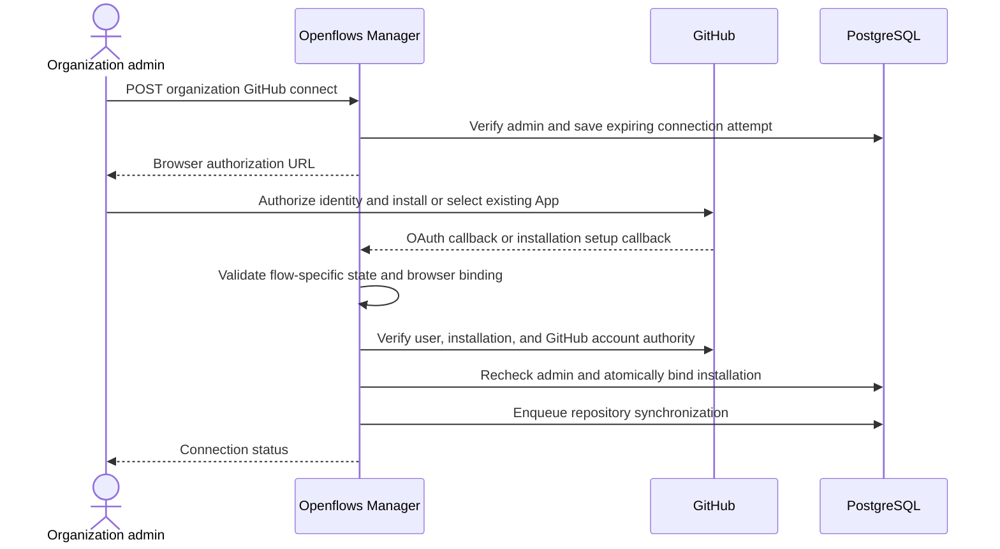

# GitHub App installation and credential exchange

Depends on [shared contracts](README.md) and [user authorization](01-user-management.md).

## 1. Credentials and trust boundaries

### The three GitHub credentials

These credentials serve different steps and must not be treated as interchangeable:

```text
Openflows secret manager
        │
        │ signs
        ▼
GitHub App private key ──> short-lived App JWT ──> GitHub installation-token endpoint
                                                        │
                                                        │ exchanges for
                                                        ▼
                                      short-lived installation access token
                                                        │
                                                        ▼
                                      repository/API access for one tenant
```

The **GitHub App private key** is the long-lived secret created when the Openflows GitHub App is registered. It proves to GitHub that a request comes from Openflows itself. Openflows keeps it only in the central secret manager. It never goes into a Coder workspace, Terraform parameter, CLI configuration, or database row. The key is used only by the trusted Manager (or a dedicated signing service) to sign App JWTs.

The **App JWT** is a short-lived signed assertion generated by the Manager from the private key. It identifies the App, contains an issued-at time and short expiry, and is sent to GitHub when Openflows needs App-level operations such as inspecting installations or exchanging for an installation token. It is not scoped to one customer's repository and must not be given to a tenant runtime. The Manager generates a new JWT as needed; it is not persisted as a reusable customer credential.

The **installation access token** is the credential used for customer repository work. The Manager exchanges the App JWT plus a verified installation ID for this token, explicitly limiting it to the tenant's repository and approved permissions. It is short-lived, cached only until near expiry, and delivered only to the authorized tenant runtime. A different Openflows organization uses a different installation ID and receives a different token scope.

There is also a separate **GitHub user authorization token**. It represents a human during login or installation-authority verification. It lets Openflows identify the person and verify that they own or administer the GitHub account involved. It is not the background credential used by Forge, Vessel, or other agents.

The trust chain is therefore:

```text
Human GitHub authorization token
  proves which person is approving the connection

GitHub App private key + App JWT
  proves that Openflows is the registered App

Installation access token
  grants the approved App installation's repository permissions
```

If the private key is compromised, an attacker can impersonate the App and mint installation tokens, so key rotation and immediate App revocation are emergency operations. If an installation token is compromised, its shorter lifetime and repository/permission scope limit the exposure; revoke the installation or rotate the connection generation to stop future issuance.

| Credential | Holder | Purpose | Forbidden use |
|---|---|---|---|
| Openflows human session | Browser/CLI | Product operations with membership checks | Runtime GitHub access |
| GitHub user authorization token | Manager, temporarily encrypted | Verify human identity and authority to bind installation | Permanent background agent credential |
| GitHub App private key | Manager secret provider/signer | Sign App JWTs | Workspace, Terraform parameter, CLI distribution |
| App JWT | Manager | Installation metadata and installation-token exchange | Git clone or customer API session |
| Installation access token | Broker and authorized workspace | Approved repo and permissions | Cross-installation sharing |
| Openflows runtime credential | Specific workspace | Broker/runtime API access | Human organization administration |

GitHub login and GitHub installation are independent flows. Developers can sign in without installing the App. Only an active Openflows admin can start or finish installation binding.

## 2. App registration and permissions

Register one App for the deployment, installable on other accounts. Configure separate login callback and installation setup URLs, plus the central webhook URL. Keep app ID, client ID, client secret, private-key reference, and webhook secret in operator configuration.

Initial permission envelope (verify each against actual client calls before release): repository metadata read, contents write, issues write, pull requests write, checks read, commit statuses read, actions read; organization members read for ownership verification. Do not request repository administration or workflow write by default. Workflow-file edits requiring extra permissions must fail with an actionable capability error until explicitly supported.

Role token profiles are explicit allowlists inside that envelope: Nexus uses contents read and issue/PR coordination permissions; Forge uses contents and PR write; Sentinel uses contents read and PR write for reviews; Vessel uses contents/PR write and CI read; Lore uses contents/PR write. Add issues write only where the role's audited call inventory requires it. Metadata read is implicit. Permission profiles are operator versioned, not supplied by a worker.

## 3. Persistence

These records are persisted in the **Openflows control-plane PostgreSQL database**. This is a new application database owned and migrated by the Openflows Manager; it is not Coder's PostgreSQL database and it is not Redis.

The deployment should run three logically separate data stores:

| Store | Owner | Data | Access rule |
|---|---|---|---|
| Openflows PostgreSQL | Openflows Manager | Users, organizations, memberships, GitHub bindings, repository inventory, tenants, operations, audit, encrypted secret references | Only Manager services and migrations |
| Coder PostgreSQL | Coder | Coder users/service accounts, organizations, templates, provisioners, workspaces, builds | Only Coder and its supported API/CLI; Openflows never writes its tables |
| Redis | Openflows runtime | Tenant execution state, queues, heartbeats, flow data | Tenant-scoped runtime access; not the source of truth for identity or authorization |

For the first deployment, provision Openflows PostgreSQL as a dedicated PostgreSQL 16 database or schema with a dedicated database role, for example:

```text
Database: openflows_control_plane
Role:     openflows_manager
Schema:   public (or an explicitly configured openflows schema)
Migrations: crates/openflows-manager/migrations/
Connection: OPENFLOWS_DATABASE_URL
```

The exact host, TLS settings, backup policy, and managed-Postgres provider are deployment choices. They must be supplied through `OPENFLOWS_DATABASE_URL` and secret management; they must not be inferred from `CODER_PG_CONNECTION_URL`. Local development may add an `openflows-db` PostgreSQL service to Compose. Production should use a separately backed-up, encrypted PostgreSQL instance with restricted network access.

The Manager runs migrations before reporting product readiness. Migrations must be forward-only, numbered, transactional where PostgreSQL permits, and tested against an empty database and a prior version. A failed migration keeps the Manager unready; it must not silently use Redis or Coder as a fallback database.

GitHub access tokens themselves are not stored as ordinary table values. The `credential_leases` row stores a token fingerprint, expiry, connection generation, and an encrypted secret-manager reference. If the selected secret provider supports short-lived secret storage, store the installation token there; otherwise encrypt the ciphertext with an envelope key held outside PostgreSQL. Never log or return stored tokens from administrative APIs. The App private key, OAuth client secret, and webhook secret are secret-manager entries referenced by configuration, not database rows.

Back up Openflows PostgreSQL independently from Coder PostgreSQL. Restore it before starting the Manager, then run GitHub and Coder reconciliation before issuing credentials. A restored database must increment or reconcile connection generations so tokens issued before the restore are not trusted blindly.

| Table | Fields and constraints |
|---|---|
| `github_connections` | `id`, `organization_id`, `app_id`, `installation_id`, `github_account_id`, account type/login snapshot, `status(pending,active,suspended,disconnected,deleted)`, `access_generation`, `connected_by`, `verified_at`, `last_reconciled_at`; UNIQUE(app_id, installation_id), composite UNIQUE(org,id) |
| `github_repositories` | `organization_id`, `connection_id`, `github_repository_id`, current owner/name, `accessible`, `last_seen_at`; PK(connection_id, repo_id), composite FK(org,connection) |
| `github_connect_attempts` | `id`, `organization_id`, `initiated_by`, `state_hash`, encrypted user-credential reference, optional candidate installation, status, expiry, consumed timestamp |
| `webhook_deliveries` | `delivery_id` PK, event/action, installation ID, payload digest, encrypted/limited raw payload for processing, received/processed timestamps, attempts and lease |
| `credential_leases` | `id`, org/tenant/workspace/installation/repo IDs, permission-profile hash, connection generation, token fingerprint, encrypted token reference, expiry, revoked timestamp |

A connection cannot move to another Openflows org through a callback or upsert. Return `INSTALLATION_ALREADY_BOUND` without naming the other org. Transfer between customers is out of scope for v1; do not hard-delete ownership history to enable reassignment.

## 4. Installation authority policy

Apply BOTH Openflows admin checks and GitHub authority checks. The v1 policy deliberately accepts personal-account owners and GitHub organization owners; delegated GitHub installation managers are deferred until their authority can be verified reliably.

1. Fetch the authenticated GitHub user using the transient user authorization token.
2. Fetch candidate installation metadata using the App JWT; verify it belongs to the configured App, is not suspended, and targets a supported account type.
3. Verify the installation appears in the user's accessible installations. This is a visibility check, NOT proof of installation administration.
4. Personal account: require installation account ID equal to authenticated GitHub user ID.
5. Organization: query organization membership for the authenticated GitHub identity; require `state=active` and `role=admin` (GitHub organization owner). Verify the organization ID matches installation metadata. Fail closed if unavailable, including SSO authorization failures.
6. Recheck active Openflows admin membership when committing the binding. Lock the membership and organization rows so concurrent revocation cannot race the final write.

Users lacking the GitHub owner role receive `GITHUB_OWNER_REQUIRED`. They may ask a GitHub owner to join Openflows as an admin. Do not silently accept repository read permission instead.

References: [user installation visibility](https://docs.github.com/en/rest/apps/installations), [organization membership API](https://docs.github.com/en/rest/orgs/members). The stricter owner-only v1 claim policy is an Openflows design decision, not a statement that GitHub permits only owners to install Apps.

## 5. Installation sequence



Use separate state values for OAuth and installation redirects, linked to one server-side connection attempt. A setup callback may not contain an OAuth code. Support either order, but do not activate the connection until both proofs exist. Expire attempts after 10 minutes and restart the flow if GitHub approval takes longer. Callback replay returns the existing safe completion page; it must not repeat a binding mutation or mint new product sessions.

Existing installations follow the same authority verification. Never trust `installation_id`, `setup_action`, a callback alone, or webhook sender identity as proof that the browser user can bind it.

## 6. Product API

Paths are relative to `/api/v1`.

| Route | Authorization and contract |
|---|---|
| `POST /organizations/{org}/github/connect` | Admin; return connection attempt and authorization URL; Idempotency-Key required |
| `GET /github/oauth/callback` | Connection-flow state validation and provider code exchange |
| `GET /github/setup` | Installation-flow state validation; store candidate ID then verify |
| `GET /organizations/{org}/github/connections` | Members; status/account only, no tokens |
| `GET /organizations/{org}/repositories` | Members; accessible repositories from connected installations |
| `POST /organizations/{org}/github/connections/{id}/reconcile` | Admin; 202 operation |
| `DELETE /organizations/{org}/github/connections/{id}` | Admin; immediately disable local access, 202 cleanup |
| `POST /webhooks/github` | Public ingress; authenticated exclusively by verified webhook signature |
| `POST /runtime/github-credentials` | Workspace runtime credential; server derives all authorization scope |

Disconnecting in Openflows disables the local binding and revokes issued tokens where possible. It does not uninstall the App globally. Offer an admin a link to GitHub installation settings for uninstall or repository selection changes. Reconnection requires a fresh admin authority flow.

Runtime request: `{ "purpose": "git" }` or `{ "purpose": "api" }`. Reject caller-supplied organization, installation, repository, or permission overrides. Response: `{ "token": "...", "expires_at": "...", "repository_id": 123, "username": "x-access-token" }`, with `Cache-Control: no-store`. Human tokens cannot call this route.

## 7. Token broker algorithm

1. Authenticate the workspace runtime credential, checking revocation and expiry in the database.
2. Join workspace -> tenant -> organization -> connection -> repository. Require active tenant, permitted workspace lifecycle, ready/active org, active connection, and accessible repo. Require fresh access reconciliation (default maximum age 5 minutes); refresh on demand if stale and deny if verification fails.
3. Resolve approved permission profile from the stored agent role. Compute cache key `(app,installation,repository_id,profile_hash,access_generation)`.
4. Reuse an unrevoked token only if at least 5 minutes remain. Use distributed single-flight locking per cache key to avoid duplicate exchanges across manager replicas.
5. Sign RS256 App JWT with `iat=now-60s`, `exp=now+9m`, configured issuer accepted by GitHub. Keep private-key handling behind `AppSigner`.
6. POST `/app/installations/{id}/access_tokens` with explicit `repository_ids: [repo_id]` and explicit permission subset. Validate returned repository scope, permissions, and expiry before use; never omit repository scope as a retry workaround.
7. Recheck connection generation and runtime authorization after the network call, before storing/delivering the token. If access changed, revoke/discard it.
8. Record the encrypted credential lease and audit metadata; return credential only to the authorized runtime. Installation tokens have no refresh token: renewal is another JWT exchange.

Reference: [installation token generation](https://docs.github.com/en/apps/creating-github-apps/authenticating-with-a-github-app/generating-an-installation-access-token-for-a-github-app).

## 8. Git and Rust client integration

Add an async `GitHubCredentialProvider` interface to the GitHub crate returning a redacted secret and expiry. Keep static-token support for explicit local mode and tests. Hosted clients request a valid credential before each API call rather than retaining one String forever.

Install an `openflows credential-helper` in workspaces. Git uses it with `credential.useHttpPath=true`. The helper accepts only HTTPS github.com and the tenant's exact repository path, obtains a current broker token, and outputs Git credential protocol fields to Git's pipe. It must refuse another repository, avoid `.git-credentials`, scrub inherited competing helpers in hosted templates, and never place credentials in remote URLs or logs. Other tools requiring tokens need a refresh-aware wrapper; do not inject one-hour tokens as permanent startup environment values.

On 401, invalidate cached credentials. Retry read-only requests once after renewal. Do not blindly retry writes after ambiguous network failures; reconcile their remote effects first. On 403, distinguish missing permissions/suspension/rate limit; never broaden token scope. Respect Retry-After and rate-limit reset information with bounded backoff.

## 9. Webhooks and revocation

Verify `X-Hub-Signature-256` against the exact raw request bytes with constant-time comparison before deserialization. Enforce a body-size limit (initially 2 MiB, configurable) and event allowlist. Persist delivery ID and durable processing event transactionally, then return 202. Duplicate identical deliveries return 202; same ID with different digest is rejected and audited. Database failure returns 503 so GitHub can retry.

Handle installation created/deleted/suspend/unsuspend, installation repositories added/removed, and authorization revocation. Unknown installations are recorded for reconciliation but never auto-bound. Installation deletion/removal increments access generation and blocks credentials immediately; asynchronously revoke recorded leases and stop affected workspaces. Unsuspension requires successful reconciliation and explicit tenant resume. User authorization revocation stops use of that user's token but does not automatically remove an independently granted installation.

Events may arrive out of order. Treat access-removing events conservatively, then fetch authoritative GitHub state. A stale added/unsuspended event must not reactivate access by itself. Reconcile every 5 minutes and at credential issuance when stale. Cache invalidation cannot erase a credential already delivered; token revocation and stopping workloads reduce that window, and the system must report incomplete revocation retries.

## 10. Tests and acceptance

- Two orgs, two installations, same App: exact repo/permission scope and no credential reuse across boundaries.
- Org developer denied even if GitHub owner; Openflows admin denied if only GitHub repo reader.
- Admin revoked between redirect and callback; replay and mismatched state; preexisting installation claim conflict.
- Token expiry, concurrent renewal, 401 renewal, 403 without scope widening, upstream rate limits.
- Wrong runtime audience, revoked workspace, stale generation, arbitrary repo override, helper path mismatch.
- Forged webhook, duplicate delivery, reordered events, missed-event reconciliation, upstream outage fail-closed.
- Disconnect stops issuance before asynchronous cleanup; uninstall affects every tenant using that installation.
- Logs, errors, audit events, Terraform artifacts, CLI output contain no App private keys or bearer tokens.
