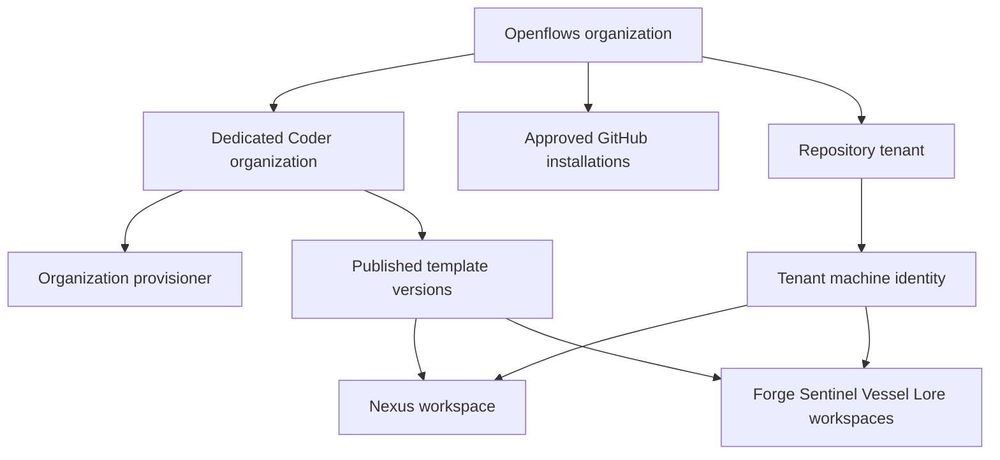

# Coder organization, template, and runtime provisioning

Depends on [shared contracts](README.md), [membership](01-user-management.md), and [GitHub access](02-github-app.md).

## 1. Resource ownership



Only the manager's platform adapter may create Coder organizations, service identities, provisioners, or publish templates. Users request product operations. Nexus requests workers by role and ticket through an authenticated runtime API; it cannot choose arbitrary templates, organization IDs, owners, host mounts, or Terraform arguments.

Each tenant has a Coder machine owner belonging only to the mapped organization, with narrowly required workspace and Agents permissions. Validate native service-account support against the deployed Coder version. If unsupported, stop the compatibility work package and document an explicit upgrade requirement. Do not substitute the global admin identity.

## 2. Persistent model

| Table | Required fields and constraints |
|---|---|
| `template_releases` | `id`, immutable `version`, `manifest_sha256`, `artifact_uri`, `status(staged,approved,retired)`, operator approval metadata; unique version and digest |
| `template_release_roles` | `release_id`, `role`, archive digest, parameter schema version, image digest; PK(release,role) |
| `organization_template_versions` | `org_id`, `release_id`, `role`, Coder template ID/version ID/import job ID, `status`, error code; UNIQUE(org,release,role) |
| `organization_provisioners` | `id`, org ID, backend resource ID, Coder provisioner reference, secret reference, status and heartbeat |
| `tenants` | `id`, `organization_id`, `slug`, `connection_id`, `github_repository_id`, pinned release ID, fleet size, desired state, observed state, error code; unique live(org,repo), unique live(org,slug), composite repo binding FK |
| `runtime_identities` | `id`, tenant ID UNIQUE, Coder owner ID UNIQUE, status, credential generation and secret reference |
| `workspaces` | `id`, org/tenant IDs, role, slot, optional ticket ID, Coder workspace ID UNIQUE, pinned template version ID, desired/observed states, credential generation; unique live(tenant,role,slot) |
| `runtime_credentials` | `id`, workspace ID, credential hash, audience, expiry/revocation timestamps, generation; secret returned only once |
| `operations` | `id`, org/resource IDs, kind, idempotency reference, state, current step, attempt count, retry_at, lease owner/expiry, error code, sanitized result |
| `operation_steps` | operation ID, step key, request digest, upstream resource ID, status, attempt, result; UNIQUE(operation,step) |

Runtime Redis namespaces use immutable tenant UUIDs, not customer-chosen names. A workspace row must reference a tenant in the same organization using composite constraints or equivalent transactional checks.

## 3. Template release contract

Keep source under `crates/coder-client/templates/`. A CI release contains all five role archives and an immutable JSON manifest:

```json
{
  "schema_version": 1,
  "release": "2026.10.0",
  "required_roles": ["nexus", "forge", "sentinel", "vessel"],
  "roles": {
    "nexus": {
      "archive": "openflows-nexus.tar.gz",
      "sha256": "<64 hex characters>",
      "parameter_schema_version": 1,
      "image_digest": "sha256:<digest>"
    }
  }
}
```

The abbreviated example must be expanded to all five roles in a real release. Lore remains published but disabled by the default registry. Package sorted paths, normalized timestamps, stable ownership, and gzip metadata; the current tar byte comparison alone does not guarantee reproducibility. Validate manifests and checksums before unpacking, reject archive path traversal, and use an operator-configured artifact origin. The manifest digest is the release identity, never a mutable `latest` URL.

Publish separately into each Coder org: upload archive, create template version, await successful import, create/bind template if absent, then persist exact IDs. The adapter must support explicit version selection in workspace creation/builds. Current comments asserting template-version APIs are unavailable must be checked against the pinned version, not treated as authoritative.

Do not infer successful publication from `updated_at` alone. Require successful import job and matching version metadata. Publication retries rediscover versions by stable release/role identity and verify metadata; they do not append unbounded duplicates.

## 4. Organization reconciliation

On org creation, transactionally insert product org, creator membership, audit/outbox, and operation. Return 202. A leased worker executes:

1. Verify supported Coder version, license capabilities, and configured release.
2. Ensure Coder organization using a deterministic internal name derived from Openflows UUID; persist ID immediately.
3. Ensure organization provisioner credentials and backend deployment; wait for heartbeat with a timeout.
4. Publish/import the approved template release for that org.
5. Verify org-scoped model availability and required Agents/chat capability.
6. Mark org ready only when all required resources are ready. GitHub connection is independent and may occur while provisioning runs; tenant creation requires both readiness and access.

Platform startup resumes unfinished operations and reconciles configured releases. It does not create customer organizations speculatively or eagerly start every workspace.

## 5. Tenant and worker provisioning

`POST /organizations/{org}/tenants` body: `{ "repository_id": 123, "name": "backend", "fleet": 2 }`. Admin/developer permitted. Resolve connection and repository server-side. Enforce one live tenant per repo, fleet >=1, configured per-org quota, and approved pinned release. Customer cannot submit registry JSON, arbitrary images, model credentials, or Terraform values. Generate registry from approved configuration and requested fleet.

Tenant operation steps:

1. Insert tenant/operation with unique constraints and reserve quota transactionally.
2. Recheck repository grant and org readiness before upstream work.
3. Ensure tenant Coder machine identity and minimal membership.
4. Allocate Redis isolation credentials and tenant network/secret resources.
5. Reserve Nexus workspace row and bootstrap credential material.
6. Create Nexus from explicit version ID and machine owner; persist Coder ID immediately.
7. Wait for build success, agent connection, runtime credential registration, then authenticated controller readiness heartbeat.
8. Mark tenant running and release temporary provisioning reservations into actual usage.

`POST /runtime/workspaces` accepts `{role, slot, ticket_id, branch}` from the tenant Nexus identity. Resolve all privileged parameters server-side. Enforce allowed role/slot, fleet quota, ticket association, safe branch syntax, and tenant-pinned release. Return 202 with workspace/operation IDs. Workers cannot call this endpoint. Provide scoped GET status and POST stop/delete operations; never expose a general Coder proxy.

Tenant states: `provisioning -> running -> paused -> deleting -> deleted`, with `failed` for actionable terminal provisioning failures and `access_blocked` for revoked GitHub access. Record desired versus observed state so retry does not erase failures. Resume from access_blocked requires fresh verification and authorized user action. Delete first revokes runtime issuance, then stops/deletes workspaces, removes credentials and owner, releases quota, and marks deleted. Do not delete shared organization templates when deleting one tenant.

### Product and runtime route completion

Paths below are relative to `/api/v1`. Every ID is resolved through the caller's authorized organization or runtime tenant. All async mutations require Idempotency-Key.

| Route | Permission and behavior |
|---|---|
| `GET /organizations/{org}/tenants` | Any active member; paginated tenants |
| `GET /organizations/{org}/tenants/{tenant}` | Any active member; lifecycle and operation references |
| `POST /organizations/{org}/tenants/{tenant}/start` | Admin/developer; verify current access, 202 |
| `POST /organizations/{org}/tenants/{tenant}/stop` | Admin/developer; set desired paused, deny new workers, 202 |
| `DELETE /organizations/{org}/tenants/{tenant}` | Admin; 202 cleanup, optional validated purge flag |
| `POST /organizations/{org}/tenants/{tenant}/clean` | Admin; `{reset_all:false}` or explicit true, 202; no arbitrary Redis commands |
| `GET /organizations/{org}/tenants/{tenant}/status` | Member; safe runtime status, never credentials |
| `GET /operations/{operation}` | Member of operation org; sanitized steps/errors |
| `POST /operations/{operation}/retry` | Current permission for original action; failed retryable operations only |
| `GET /runtime/workspaces/{workspace}` | Nexus of same tenant, or that workspace's own principal |
| `POST /runtime/workspaces/{workspace}/stop` | Tenant Nexus only; 202 |
| `DELETE /runtime/workspaces/{workspace}` | Tenant Nexus only; workers only, not Nexus self-deletion |
| `POST /runtime/heartbeat` | Workspace principal; status and observed readiness, cannot change ownership |
| `POST /runtime/refresh` | Valid rotating runtime refresh credential |

Quotas are platform-configured ceilings stored per org: live tenants, fleet pairs per tenant, live workspaces, and concurrent provisioning operations. Fleet N reserves capacity for 2N Forge/Sentinel workers plus Nexus and any enabled ancillary roles. Reserve/check capacity transactionally, release reservations on terminal failure/deletion, and reconcile leaked reservations from durable resource records. Do not use caller-provided quota values or count only currently ready workspaces. Initial numerical limits are operator settings validated as positive integers; missing ceilings prevent hosted readiness.

## 6. Credential delivery and lifecycle hooks

Hosted templates MUST NOT contain platform Coder tokens, App private keys, deployment hook signing secrets, or GitHub external-auth token interpolation. Secrets marked sensitive in Terraform can still persist in state; redaction is not isolation.

Use a provisioner/backend secret-injection adapter. For a Kubernetes production backend, the manager creates a per-workspace Secret mounted only into that workload; Terraform receives its name, never its contents. Use a namespace/service account and RBAC boundary that prevents tenant pods reading other secrets. Local Docker development uses a restricted per-workspace mounted secret file, never a global host directory. The production backend is a proposed default and must be recorded in the compatibility work package; the current Docker Compose stack is not accepted as a public isolation boundary without validation.

Bootstrap credential: 256-bit random, hashed centrally, tied to workspace/tenant, expires after 10 minutes. Workspace uses `POST /runtime/register` to exchange it for a workspace credential (15-minute access + rotating refresh, maximum 24-hour family). Bind retrieval to the assigned secret mount and expected workspace record. Atomically consume bootstrap credential; replay fails. If response is lost, the manager revokes that attempted session and provisions new bootstrap material, rather than returning stored plaintext. Rotate runtime refresh credentials, check workspace/tenant revocation on every broker request, and rotate the family through fresh backend injection before its maximum lifetime expires.

Existing Coder chat operations may still require a tenant Coder credential inside Nexus. Supply only the tenant machine owner's restricted token through the same secret mechanism, with refresh/rotation support in `CoderClient`. Prefer server-mediated operations where upstream RBAC cannot enforce tenant scope. Contract-test all remaining direct operations, especially org-scoped chat/model listing. If the tenant token can read another tenant's chats/workspaces, move those operations behind manager authorization before release.

Move deployment-wide Coder hook verification into the trusted manager ingress. Validate Coder hook JWTs there, resolve workspace/chat ownership from server-held mappings, and relay to the correct Nexus using a tenant-specific signing key or authenticated channel. Preserve existing hook response semantics and deadlines. Do not distribute the global hook signing secret to customer workspaces. Test forged cross-tenant hook routing and tenant-key compromise boundaries.

## 7. Durable retries and idempotency

Lease operation rows using database locking (`FOR UPDATE SKIP LOCKED`) and lease expiry; heartbeat while running. Suggested defaults: 30-second lease, 10-second heartbeat, exponential retry 1–60 seconds with jitter, eight automatic attempts, then actionable failed status. Permanent auth/schema errors fail immediately; rate limits honor upstream delay.

Each upstream resource has a deterministic name/metadata identity derived from product UUID and a persisted step record. On timeout-after-create, rediscover and verify org, owner, template version, and resource identity before retry. Never adopt a same-name workspace from another owner or tenant. Do not roll back by deleting successfully created resources blindly; resume from recorded steps. An explicit cancel/delete operation handles cleanup.

## 8. Release promotion and rollback

Operator approves a release only after import and canary validation. New tenants pin that release. Existing tenants keep their release until an explicit operator migration operation stops/drains workers, records the previous pin, validates parameters, and rebuilds affected workspaces. No automatic upgrade from Coder's active template pointer.

Rollback changes the desired pin to a previously verified release and rebuilds through an operation. Terraform state/data compatibility must be checked; a version switch is not a promise to reverse destructive infrastructure changes. Preserve needed versions while any tenant references them.

## 9. Client changes and verification

Add `CoderOrganizationId`, `CoderTemplateId`, `CoderTemplateVersionId`, owner-aware creation DTOs, and explicit-org model/chat methods to `coder-client`. Keep local compatibility wrappers only outside hosted paths. The hosted code must reject missing org IDs rather than use `get_default_organization_id()`.

Update Nexus provisioning and all its default-org call sites. Replace local template-hash cache with server-side `(Coder deployment, org, release, role)` records. Update all five templates, controller environment resolution, Git credential setup, and lifecycle hook routing together.

Tests: same template names in two orgs resolve correctly; pinned versions survive promotion; concurrent tenant creation is unique; retries after every step do not duplicate resources; missing provisioner/model/license prevents ready; wrong-owner 409 recovery rejected; no global secrets in build parameters/state/logs; runtime renewal works after 24 hours; Redis ACL and network access to another tenant denied; scoped Coder tokens cannot cross tenant boundaries.

References: [organizations](https://coder.com/docs/admin/users/organizations), [template API](https://coder.com/docs/reference/api/templates), [workspace API](https://coder.com/docs/reference/api/workspaces), [machine-user creation](https://coder.com/docs/reference/cli/users/create). Verify exact routes, fields, and permissions against the pinned Coder version before implementing adapters.
