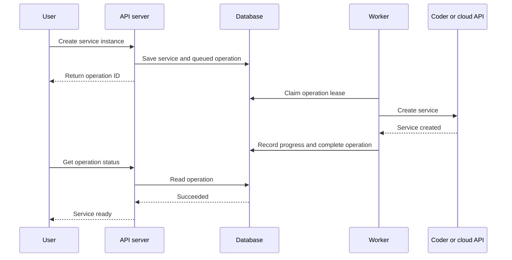
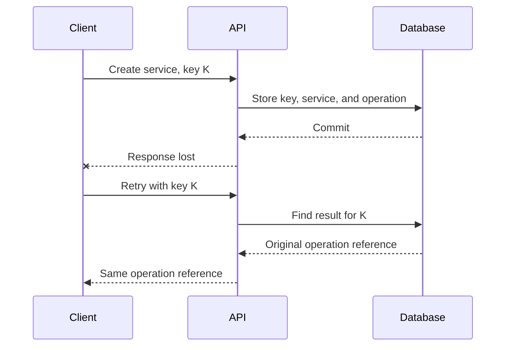
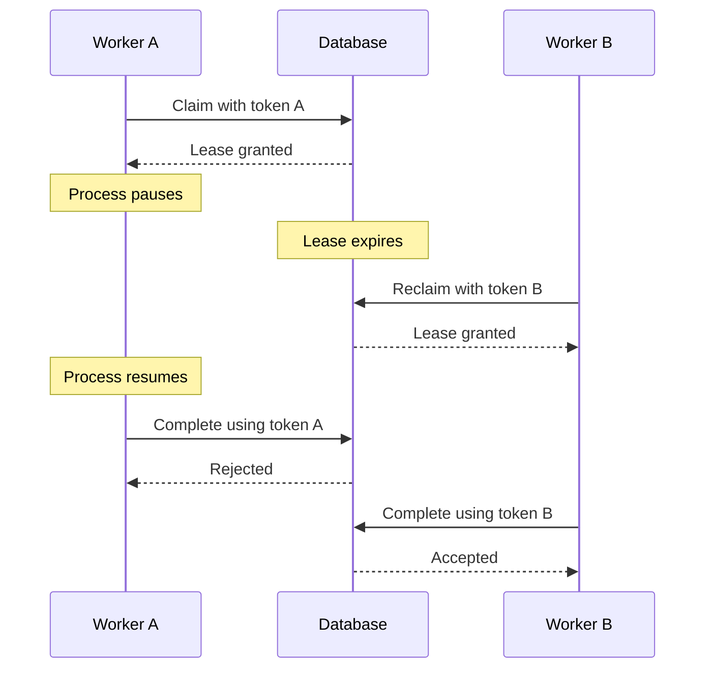
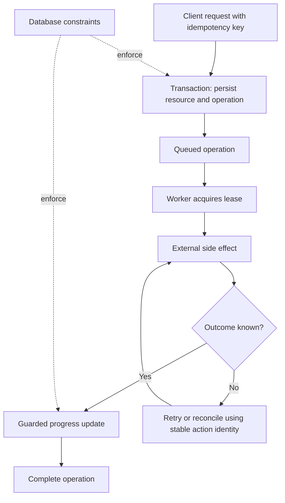

# Transactions, Leases, and Idempotency: Making Background Operations Safe to Retry

When a background operation fails halfway through, retrying it is not automatically safe.

Imagine a user asks an application to create a service instance. The API accepts the request and places a provisioning operation in a database queue. A **background worker** is a separate long-running process that periodically polls that queue, claims the next operation, and performs the slow work independently of the user's HTTP request. For example, it might call a cloud provider's `CreateService` API, wait for the service to become ready, and save the result. If that worker crashes before saving the provider's response, the database still says `provisioning`, but the service may already exist.

If the system retries blindly, it may create a duplicate. If it never retries, the operation may remain stuck forever.

This is why reliable systems use several different mechanisms together. Transactions, operation leases, idempotency, and database constraints solve different failure problems.

| Mechanism | Question it answers |
| --- | --- |
| Transaction | Which database changes must commit or roll back together? |
| Operation lease | Which execution currently has permission to advance this operation? |
| Idempotency | What should happen when the same logical request is repeated? |
| Database constraint | Which invalid states must the database reject? |

## Start with the actors

Before discussing leases, define a worker clearly.

A **background worker** is a long-running process that looks for unfinished operations and performs their next step outside the request path. In a deployment platform, one worker might receive an operation saying, “Create a service instance for tenant A.” It reads the operation, calls a provider, waits for the result, records progress, and eventually marks the operation complete. The user can close their browser while this process continues, and another worker can take over if the first process stops.

The worker is different from the other actors:

- The **user** requests an action.
- The **API server** authenticates the request and records durable work.
- The **worker** performs the slow background action.
- The **external system** creates the service.



The important detail is that the API does not keep the user request open while the external operation runs. It records work and returns an operation ID. A worker can continue after the original HTTP request has ended.

## What a transaction protects

Suppose the API must create a service record and schedule its provisioning. Writing those records separately creates a failure window: the service may exist without any durable work scheduled to create it.

```sql
BEGIN;

INSERT INTO services (...);

INSERT INTO operations (..., state)
VALUES (..., 'queued');

COMMIT;
```

The transaction guarantees that these local database changes commit together or roll back together.

It does not include the cloud provider's API call. Keeping a database transaction open while waiting for a remote service would hold locks and still would not make the remote side effect roll back when the process dies.

Transactions provide local atomicity. They do not provide atomicity across unrelated systems.

## What idempotency protects

Now imagine the client submits the request, but the network fails before it receives the response. The client retries.

Without an idempotency key, the server may create a second service. With one, the client identifies both attempts as the same logical request.

The server can use this contract:

| Request | Result |
| --- | --- |
| New key | Accept the operation |
| Same key and same input | Return the original result |
| Same key and different input | Reject the conflicting reuse |

The server stores the key, a fingerprint of the request, and the result reference in the same transaction that accepts the operation. For an asynchronous API, the result can be the original operation and resource IDs.



## What a database constraint protects

A database constraint is a rule that PostgreSQL checks for every write, including writes made by two requests that arrive at the same time. It is the final guard against invalid state; application checks performed before an insert are useful, but two requests can both pass those checks before either one commits.

For example, suppose the product allows one GitHub installation connection per Openflows organization:

```sql
CREATE UNIQUE INDEX one_installation_per_org
    ON github_installations (organization_id);
```

Two concurrent requests can both ask, “Is there already an installation for organization A?” and both receive “no.” They then both try to insert. The unique index allows one insert and rejects the other, so the database still contains one connection rather than two. A foreign-key constraint can similarly require every membership to refer to an existing organization, and a check constraint can reject an invalid status.

The application must translate the constraint result into a useful response and retry safely when appropriate. A uniqueness error alone does not tell the API whether the caller repeated the same request, whether another caller won the race, or whether the request conflicts with an existing record.

Idempotency uses the same idea. A unique index can enforce one record per scoped key, but the application must also store the request fingerprint and compare it. If the retry has the same key and the same request, the API returns the original result. If the same key is reused with a different request, the API returns a conflict.

Idempotency also has a scope and a retention period. A key is usually scoped to the caller, organization, route, and request body. After the key expires, ordinary business constraints must still prevent invalid duplicates.

## What a lease protects

A durable operation survives the process that created it. Several workers may poll the operations table, so the system needs temporary ownership.

A worker claims an available operation by atomically recording:

```text
lease_owner
lease_token
lease_expires_at
```

The claim transaction locks an eligible row, assigns a fresh token, sets an expiry, and commits. PostgreSQL's `FOR UPDATE SKIP LOCKED` lets competing workers skip rows currently being claimed. The row lock coordinates the short claim transaction; the persisted lease records ownership after that transaction ends.

```text
BEGIN
  Select an eligible operation and lock its row.
  Assign worker identity, fresh claim token, and expiry.
COMMIT

Perform slow external work outside the transaction.
```

The lease might last 30 seconds, with a heartbeat every 10 seconds. The worker must check the heartbeat result. A rejected heartbeat means it has lost authority and should stop making progress updates.

If the worker crashes, its lease eventually expires. Another worker can reclaim the operation.

## The stale-worker problem

Lease expiry creates a subtle race: the old worker may still be alive. It may have paused, lost its network connection, or been delayed by the runtime. When it resumes, it can try to write progress after another worker has taken over.



Worker names are not enough. A restarted process may reuse the same name. Every claim therefore receives a fresh token, and every heartbeat, progress update, completion, and failure update checks the current owner, token, and unexpired lease.

```sql
UPDATE operations
SET state = 'succeeded',
    lease_owner = NULL,
    lease_token = NULL,
    lease_expires_at = NULL
WHERE id = $1
  AND lease_owner = $2
  AND lease_token = $3
  AND lease_expires_at > clock_timestamp();
```

The caller must treat zero affected rows as a rejected stale update.

This token protects database state. It does not physically stop the old worker, and it does not automatically protect an external API that knows nothing about the lease.

## Leases are not fencing by themselves

Suppose Worker A sends a delayed request to a cloud provider after losing its lease. The database cannot cancel a request already sent to a provider.

A stronger design uses a fencing token: successive owners receive increasing numbers, and the protected resource rejects requests with an older number. That only works when the external resource enforces the number. A random UUID checked only by our database identifies a claim; it does not provide ordering to an independent service.

When external fencing is unavailable, use provider idempotency or reconciliation. Give the logical step a stable identity such as `operation-123:create-service`, and use that identity across worker retries. The lease token should change on each claim; the external action identity should remain stable for the same intended side effect.

## Database constraints complete the picture

Application checks are useful for good error messages, but concurrent requests can pass the same check before either writes. The database must enforce invariants that cannot be violated.

For example:

```sql
UNIQUE (organization_id, service_name)
```

Two concurrent requests may both ask whether `payments` is available. The unique constraint is the final authority.

Constraints protect stored state. They do not execute background work, recover a crashed worker, or make a remote API call idempotent.

## Putting the mechanisms together



The complete workflow looks like this:

1. The client sends a request with an idempotency key.
2. A transaction creates the resource record, operation, and any outbox event together.
3. A worker claims the operation with a temporary lease.
4. The worker performs the external action outside the database transaction.
5. The worker renews its lease while it is still the current owner.
6. The external step uses provider idempotency or reconciliation where possible.
7. The worker records service progress only with its current claim token.
8. If it crashes, another worker reclaims the expired operation.

No single mechanism provides exactly-once execution across a database and an external service. The design instead makes each boundary explicit and makes retries converge safely.

## How to test the design

Test the failure scenarios directly:

- Race several workers against one queued operation and verify that only one active claim is returned.
- Expire a lease, reclaim the operation, and verify that the old token cannot heartbeat or complete it.
- Reuse a worker name with a new token and verify that the old guard remains invalid.
- Submit the same idempotent request concurrently and verify that it creates one logical operation.
- Reuse an idempotency key with different input and verify rejection.
- Simulate an external success followed by a worker crash and verify reconciliation or provider idempotency.
- Run concurrent requests against uniqueness constraints and verify that invalid state cannot be stored.

Database integration tests establish local concurrency behavior. Provider contract tests establish what the external service guarantees. One cannot substitute for the other.

## Final distinction

The cleanest way to reason about background work is to ask four separate questions:

- **Transaction:** Which local changes belong together?
- **Lease:** Which worker may act now?
- **Idempotency:** What should happen when the same intent is repeated?
- **Constraint:** Which states are impossible?

Once those questions are separated, crash recovery becomes a design problem with explicit boundaries instead of a collection of hopeful retries.

---

Further reading:

- [PostgreSQL SELECT and row-locking documentation](https://www.postgresql.org/docs/16/sql-select.html)
- [PostgreSQL constraints](https://www.postgresql.org/docs/16/ddl-constraints.html)
- [AWS Builders' Library: Making retries safe with idempotent APIs](https://aws.amazon.com/builders-library/making-retries-safe-with-idempotent-APIs/)
- [Martin Kleppmann: How to do distributed locking](https://martin.kleppmann.com/2016/02/08/how-to-do-distributed-locking.html)
