# SharedStore Documentation

## 1. Overview & Purpose

The `SharedStore` is a core component of AgentFlow that enables **inter-agent communication** and **state management**. It provides a centralized key-value store where agents can:

- Read and write shared state (tickets, worker slots, PRs)
- Emit and query structured lifecycle events
- Coordinate work across the agent ecosystem

The SharedStore is designed with a **dual-backend architecture** to support both development/testing (in-memory) and production (Redis) environments seamlessly.

## 2. Backend Configuration

### Dual-Backend Design

The `SharedStore` supports two backends:

| Backend            | Use Case                             | Persistence                | Performance     |
|--------------------|--------------------------------------|----------------------------|-----------------|
| **In-Memory**      | Development, unit tests, local demos | Volatile (lost on restart) | Fastest         |
| **Redis**          | Production, distributed deployments  | Persistent                 | Network latency |

### Backend Selection

Backend selection is controlled by the `REDIS_URL` environment variable:

```rust
// In-memory backend (dev/tests)
let store = SharedStore::new_in_memory();

// Redis backend (production)
let store = SharedStore::new_redis("redis://127.0.0.1/").await?;
```

**Environment-based initialization pattern:**

```rust
use std::env;

async fn initialize_store() -> Result<SharedStore> {
    match env::var("REDIS_URL") {
        Ok(url) => SharedStore::new_redis(&url).await,
        Err(_) => Ok(SharedStore::new_in_memory()),
    }
}
```

### TUI / Monitoring Interface

The event ring buffer is designed to support a **Terminal User Interface (TUI)** for real-time monitoring of agent activities:

- **`get_events_since(cursor)`** - Allows a TUI to "tail" new events efficiently
- **`event_count()`** - Enables initial render of existing events

A TUI would typically:
1. Query `event_count()` on startup to render historical events
2. Poll `get_events_since(last_cursor)` in a loop to display new events as they occur
3. Show agent lifecycle phases (prep → exec → post) in real-time

This enables operators to watch the orchestration flow, debug issues, and monitor system health without reading raw logs.

## 3. API Reference

### Core Key-Value Operations

```rust
impl SharedStore {
    /// Get a raw JSON value by key. Returns None if key doesn't exist.
    pub async fn get(&self, key: &str) -> Option<Value>;

    /// Set a raw JSON value by key. Overwrites if exists.
    pub async fn set(&self, key: &str, value: Value);

    /// Delete a key and its value.
    pub async fn del(&self, key: &str);

    /// Typed get - deserializes JSON into T. Returns None on missing key or type mismatch.
    pub async fn get_typed<T: DeserializeOwned>(&self, key: &str) -> Option<T>;

    /// Typed set - serializes T to JSON Value.
    pub async fn set_typed<T: Serialize>(&self, key: &str, value: &T) -> Result<()>;
}
```

### Event System Operations

```rust
impl SharedStore {
    /// Emit a structured event to the ring buffer.
    pub async fn emit(&self, agent: &str, event_type: &str, payload: Value);

    /// Get all events since a cursor index (for TUI tail loop).
    pub async fn get_events_since(&self, cursor: usize) -> Vec<StoreEvent>;

    /// Get total event count in ring buffer.
    pub async fn event_count(&self) -> usize;
}
```

### StoreEvent Structure

```rust
#[derive(Debug, Clone, Serialize, Deserialize)]
pub struct StoreEvent {
    pub agent: String,       // Agent that emitted the event (e.g., "nexus", "forge")
    pub event_type: String,  // Event type (e.g., "prep_started", "ticket_merged")
    pub payload: Value,      // Arbitrary JSON payload
    pub ts: u64,             // Unix timestamp in milliseconds
}
```

## 4. Event System

### Event Ring Buffer

The SharedStore maintains a **1000-event circular buffer** for agent lifecycle tracking:

- Events are automatically dropped when the buffer is full (FIFO)
- Every node lifecycle phase emits events automatically
- Used by TUI for real-time monitoring

### Automatic Lifecycle Events

The [`Node::run()`](crates/pocketflow-core/src/node.rs:35) method automatically emits these events:

| Phase            | Event Emitted  |
|------------------|--------------- |
| `prep` starts    | `prep_started` |
| `prep` completes | `prep_done`    |
| `exec` starts    | `exec_started` |
| `exec` completes | `exec_done`    |
| `post` starts    | `post_started` |
| `post` completes | `post_done`    |

### BatchNode Lifecycle Events

The [`BatchNode::run_batch()`](crates/pocketflow-core/src/batch.rs:30) method emits:

| Phase               | Event Emitted        |
|---------------------|----------------------|
| `prep_batch` starts | `batch_prep_started` |
| No items to process | `batch_empty`        |
| `exec` starts       | `batch_exec_started` |
| `exec` completes    | `batch_exec_done`    |
| Batch completes     | `batch_done`         |

### Custom Event Examples

```rust
// VESSEL emits merge events
store.emit(
    "vessel",
    "ticket_merged",
    json!({
        "ticket_id": "T-001",
        "pr_number": 42,
        "sha": "abc123"
    })
).await;

// FORGE emits progress events
store.emit(
    "forge",
    "work_progress",
    json!({
        "ticket_id": "T-001",
        "worker_id": "forge-1",
        "status": "implementing"
    })
).await;
```

## 5. Key Namespaces

### Core State Keys (from [`config::state`](crates/config/src/state.rs:84))

| Key                      | Type                                   | Description                   | Written By           | Read By      |
|--------------------------|----------------------------------------|-------------------------------|----------------------|--------------|
| `tickets`                | `Vec<Ticket>`                          | All work items/tickets        | NEXUS, FORGE, VESSEL | All agents   |
| `worker_slots`           | `HashMap<String, WorkerSlot>`          | Worker availability state     | NEXUS, FORGE         | NEXUS, FORGE |
| `pending_prs`            | `Vec<Value>`                           | PRs awaiting merge            | FORGE, NEXUS         | VESSEL       |
| `command_gate`           | `HashMap<String, Value>`               | Dangerous operation proposals | FORGE                | NEXUS        |

### Ticket Schema

```rust
#[derive(Debug, Clone, Serialize, Deserialize)]
pub struct Ticket {
    pub id: String,              // e.g., "T-001"
    pub title: String,
    pub body: String,
    pub priority: u32,
    pub branch: Option<String>,
    pub status: TicketStatus,
    pub issue_url: Option<String>,
    pub attempts: u32,           // Retry counter
}

#[derive(Debug, Clone, Serialize, Deserialize)]
#[serde(tag = "type", rename_all = "snake_case")]
pub enum TicketStatus {
    Open,
    Assigned { worker_id: String },
    InProgress { worker_id: String },
    Completed { worker_id: String, outcome: String },
    Merged { worker_id: String, pr_number: u64 },
    Failed { worker_id: String, reason: String, attempts: u32 },
    Exhausted { worker_id: String, attempts: u32 },
}
```

### WorkerSlot Schema

```rust
#[derive(Debug, Clone, Serialize, Deserialize)]
pub struct WorkerSlot {
    pub id: String,              // e.g., "forge-1"
    pub status: WorkerStatus,
}

#[derive(Debug, Clone, Serialize, Deserialize)]
#[serde(tag = "type", rename_all = "snake_case")]
pub enum WorkerStatus {
    Idle,
    Assigned { ticket_id: String, issue_url: Option<String> },
    Working { ticket_id: String, issue_url: Option<String> },
    Done { ticket_id: String, outcome: String },
    Suspended { ticket_id: String, reason: String, issue_url: Option<String> },
}
```

### Pending PR Schema

```rust
// Stored under `pending_prs` key
{
    "number": 42,
    "ticket_id": "T-001",
    "head_branch": "forge-1/T-001",
    "base_branch": "main",
    "title": "Add feature X",
    "mergeable": true,
    "worker_id": "forge-1"
}
```

### Internal/Transient Keys

| Key Pattern                      | Purpose                                         | Example                                                   |
|----------------------------------|-------------------------------------------------|-----------------------------------------------------------|
| `_no_work_count`                 | Consecutive no-work counter (NEXUS stop signal) | `3`                                                       |
| `_conflict_attempts_{pr_number}` | Conflict resolution retry counter               | `2`                                                       |
| `_ci_fix_attempts_{pr_number}`   | CI fix retry counter                            | `1`                                                       |
| `_forge_batch_workers`           | Workers being processed in current batch        | `["forge-1", "forge-2"]`                                  |
| `ci_readiness`                   | CI workflow detection status                    | `{"type": "Ready"}`                                       |
| `repository`                     | Target repo for GitHub operations               | `"owner/repo"`                                            |
| `ticket:{id}:status`             | Individual ticket status (VESSEL)               | `"Merged"`                                                |

## 6. Agent Interaction Patterns

### Node Lifecycle Integration

All agents implement the [`Node`](crates/pocketflow-core/src/node.rs:20) trait with three phases:

```rust
#[async_trait]
pub trait Node: Send + Sync {
    fn name(&self) -> &str;

    /// Phase 1: READ ONLY from SharedStore
    async fn prep(&self, store: &SharedStore) -> Result<Value>;

    /// Phase 2: Pure computation / external I/O (NO store access)
    async fn exec(&self, prep_result: Value) -> Result<Value>;

    /// Phase 3: WRITE results to SharedStore, return routing Action
    async fn post(&self, store: &SharedStore, exec_result: Value) -> Result<Action>;
}
```

**Critical Rule**: `exec()` does NOT have access to the store to enforce the no-write contract during external I/O.

### NEXUS Pattern: Orchestrator

```rust
// Phase 1: Read state and sync with GitHub
async fn prep(&self, store: &SharedStore) -> Result<Value> {
    // Sync registry to get available worker slots
    self.sync_registry(store).await?;
    
    // Sync issues from GitHub
    self.sync_issues(store, &owner, &repo_name).await?;
    
    // Sync open PRs
    self.sync_open_prs(store, &owner, &repo_name).await?;
    
    // Read current state
    let tickets: Vec<Ticket> = store.get_typed(KEY_TICKETS).await.unwrap_or_default();
    let worker_slots: HashMap<String, WorkerSlot> = 
        store.get_typed(KEY_WORKER_SLOTS).await.unwrap_or_default();
    let open_prs = store.get(KEY_PENDING_PRS).await.unwrap_or(json!([]));
    
    Ok(json!({
        "tickets": tickets,
        "worker_slots": worker_slots,
        "open_prs": open_prs,
        // ... more context
    }))
}

// Phase 3: Assign work and update state
async fn post(&self, store: &SharedStore, result: Value) -> Result<Action> {
    let decision: AgentDecision = serde_json::from_value(result)?;
    
    if decision.action == "work_assigned" {
        // Update ticket status
        let mut tickets: Vec<Ticket> = store.get_typed(KEY_TICKETS).await.unwrap_or_default();
        if let Some(ticket) = tickets.iter_mut().find(|t| t.id == decision.ticket_id) {
            ticket.status = TicketStatus::Assigned {
                worker_id: decision.assign_to.clone(),
            };
        }
        store.set(KEY_TICKETS, json!(tickets)).await;
        
        // Update worker slot
        let mut slots: HashMap<String, WorkerSlot> = 
            store.get_typed(KEY_WORKER_SLOTS).await.unwrap_or_default();
        if let Some(slot) = slots.get_mut(&decision.assign_to) {
            slot.status = WorkerStatus::Assigned {
                ticket_id: decision.ticket_id.clone(),
                issue_url: decision.issue_url.clone(),
            };
        }
        store.set(KEY_WORKER_SLOTS, json!(slots)).await;
    }
    
    Ok(Action::new(decision.action))
}
```

### FORGE Pattern: Batch Processing

FORGE implements [`BatchNode`](crates/pocketflow-core/src/batch.rs:17) for parallel worker processing:

```rust
#[async_trait]
impl BatchNode for ForgeNode {
    // Phase 1: Return one work item per available worker slot
    async fn prep_batch(&self, store: &SharedStore) -> Result<Vec<Value>> {
        let slots: HashMap<String, WorkerSlot> = 
            store.get_typed(KEY_WORKER_SLOTS).await.unwrap_or_default();
        
        let active_workers: Vec<Value> = slots
            .values()
            .filter(|s| matches!(s.status, 
                WorkerStatus::Assigned { .. } | WorkerStatus::Working { .. }))
            .map(|s| json!(s))
            .collect();
        
        Ok(active_workers)
    }

    // Phase 2: Process one item (runs concurrently across all items)
    async fn exec_one(&self, item: Value) -> Result<Value> {
        let slot: WorkerSlot = serde_json::from_value(item)?;
        
        // Spawn Claude Code process, wait for completion
        // Read STATUS.json from worktree
        // Return outcome
        
        Ok(json!({
            "worker_id": slot.id,
            "ticket_id": ticket_id,
            "outcome": "pr_opened", // or "failed", "suspended", etc.
            "pr_number": 42,
        }))
    }

    // Phase 3: Collect all results, update store
    async fn post_batch(&self, store: &SharedStore, results: Vec<Result<Value>>) -> Result<Action> {
        let mut slots: HashMap<String, WorkerSlot> = 
            store.get_typed(KEY_WORKER_SLOTS).await.unwrap_or_default();
        let mut tickets: Vec<Ticket> = store.get_typed(KEY_TICKETS).await.unwrap_or_default();
        let mut opened_prs: Vec<Value> = Vec::new();
        
        for res in results {
            let res = res?;
            let worker_id = res["worker_id"].as_str().unwrap_or("");
            let outcome = res["outcome"].as_str().unwrap_or("failed");
            
            if let Some(slot) = slots.get_mut(worker_id) {
                match outcome {
                    "pr_opened" => {
                        slot.status = WorkerStatus::Done { 
                            ticket_id: ticket_id.to_string(),
                            outcome: "pr_opened".to_string(),
                        };
                        opened_prs.push(json!({
                            "number": res["pr_number"].as_u64().unwrap_or(0),
                            "ticket_id": ticket_id,
                            "head_branch": res["branch"].as_str().unwrap_or(""),
                        }));
                    }
                    "suspended" => {
                        slot.status = WorkerStatus::Suspended {
                            ticket_id: ticket_id.to_string(),
                            reason: res["reason"].as_str().unwrap_or("").to_string(),
                            issue_url: None,
                        };
                    }
                    _ => {
                        slot.status = WorkerStatus::Idle;
                    }
                }
            }
        }
        
        // Write updates back to store
        store.set(KEY_WORKER_SLOTS, json!(slots)).await;
        store.set(KEY_TICKETS, json!(tickets)).await;
        
        // Add new PRs to pending_prs for VESSEL
        if !opened_prs.is_empty() {
            let mut pending_prs: Vec<Value> = 
                store.get_typed(KEY_PENDING_PRS).await.unwrap_or_default();
            pending_prs.extend(opened_prs);
            store.set(KEY_PENDING_PRS, json!(pending_prs)).await;
        }
        
        Ok(Action::new(ACTION_PR_OPENED))
    }
}
```

### VESSEL Pattern: Merge Gatekeeper

```rust
#[async_trait]
impl Node for VesselNode {
    async fn prep(&self, store: &SharedStore) -> Result<Value> {
        // Read pending PRs from store
        let pending_prs: Option<Vec<Value>> = store.get_typed("pending_prs").await;
        let ci_readiness: Option<CiReadiness> = store.get_typed("ci_readiness").await;
        
        Ok(json!({
            "pending_prs": pending_prs.unwrap_or_default(),
            "has_ci_workflows": matches!(ci_readiness, Some(CiReadiness::Ready)),
        }))
    }

    async fn post(&self, store: &SharedStore, exec_result: Value) -> Result<Action> {
        let outcomes: Vec<VesselOutcome> = 
            serde_json::from_value(exec_result["outcomes"].clone()).unwrap_or_default();
        
        for outcome in outcomes {
            match outcome {
                VesselOutcome::Merged { ticket_id, pr_number, sha } => {
                    // Emit event for dependency resolution
                    store.emit("vessel", "ticket_merged", json!({
                        "ticket_id": ticket_id,
                        "pr_number": pr_number,
                        "sha": sha,
                    })).await;
                    
                    // Update ticket status
                    let mut tickets: Vec<Ticket> = 
                        store.get_typed(KEY_TICKETS).await.unwrap_or_default();
                    if let Some(ticket) = tickets.iter_mut().find(|t| t.id == ticket_id) {
                        ticket.status = TicketStatus::Merged { 
                            worker_id: "vessel".to_string(), 
                            pr_number 
                        };
                    }
                    store.set(KEY_TICKETS, json!(tickets)).await;
                    
                    // Remove from pending_prs
                    let mut pending: Vec<Value> = 
                        store.get_typed("pending_prs").await.unwrap_or_default();
                    pending.retain(|pr| pr["number"].as_u64() != Some(pr_number));
                    store.set("pending_prs", json!(pending)).await;
                    
                    // Recycle worker back to Idle
                    self.recycle_worker(store, &pr).await;
                }
                VesselOutcome::CiFailed { ticket_id, pr_number, reason } => {
                    store.emit("vessel", "ci_failed", json!({
                        "ticket_id": ticket_id,
                        "pr_number": pr_number,
                        "reason": reason,
                    })).await;
                    
                    // Reassign worker for CI fix
                    self.assign_worker_for_ci_fix(store, worker_id, ticket_id).await;
                }
                // ... other outcomes
            }
        }
        
        Ok(Action::new(Action::DEPLOYED))
    }
}
```

### SENTINEL Pattern: Ephemeral Evaluator

SENTINEL is spawned ephemerally for code review and doesn't read from the SharedStore during its core evaluation logic (it uses filesystem-based state in the pair harness). However, it does write results back to the store for downstream agents to consume:

```rust
#[async_trait]
impl Node for SentinelNode {
    async fn prep(&self, _store: &SharedStore) -> Result<Value> {
        // Load persona and build prompt
        let persona = self.load_persona().await?;
        let prompt = self.build_prompt(&persona).await?;
        Ok(json!({ "prompt": prompt }))
    }

    async fn exec(&self, prep_result: Value) -> Result<Value> {
        // Spawn SENTINEL process, wait for evaluation
        let status = self.spawn_and_wait(prompt).await?;
        Ok(json!({
            "verdict": status.verdict,  // "approved" or "changes_requested"
            "blockers": status.blockers,
        }))
    }

    async fn post(&self, store: &SharedStore, exec_result: Value) -> Result<Action> {
        // Store evaluation result for downstream nodes
        store.set("sentinel_evaluation", exec_result.clone()).await;
        
        let verdict = exec_result["verdict"].as_str().unwrap_or("changes_requested");
        match verdict {
            "approved" => Ok(Action::new("approved")),
            _ => Ok(Action::new("changes_requested")),
        }
    }
}
```

## 7. Testing with In-Memory Backend

### Unit Test Pattern

```rust
#[tokio::test]
async fn test_node_lifecycle() {
    let store = SharedStore::new_in_memory();
    let node = MyNode::new();
    
    // Run the node
    let action = node.run(&store).await.unwrap();
    assert_eq!(action.as_str(), "done");
    
    // Verify store state
    let output = store.get("output").await.unwrap();
    assert_eq!(output["value"], 42);
    
    // Verify events were emitted
    let events = store.get_events_since(0).await;
    assert_eq!(events.len(), 6); // prep_started, prep_done, exec_started, exec_done, post_started, post_done
    assert_eq!(events[0].event_type, "prep_started");
}
```

### Integration Test Pattern

```rust
#[tokio::test]
async fn test_full_flow() {
    let store = SharedStore::new_in_memory();
    
    // Setup initial state
    let tickets = vec![Ticket {
        id: "T-001".to_string(),
        title: "Test ticket".to_string(),
        body: "Description".to_string(),
        priority: 1,
        branch: None,
        status: TicketStatus::Open,
        issue_url: None,
        attempts: 0,
    }];
    store.set_typed(KEY_TICKETS, &tickets).await.unwrap();
    
    // Run NEXUS
    let nexus = NexusNode::new(...);
    let action = nexus.run(&store).await.unwrap();
    
    // Verify work was assigned
    let tickets: Vec<Ticket> = store.get_typed(KEY_TICKETS).await.unwrap();
    assert!(matches!(tickets[0].status, TicketStatus::Assigned { .. }));
}
```

## 8. Production Redis Setup

### Docker Compose Configuration

```yaml
version: '3.8'
services:
  redis:
    image: redis:7-alpine
    ports:
      - "6379:6379"
    volumes:
      - redis_data:/data
    command: redis-server --appendonly yes

  openflows:
    build: .
    environment:
      - REDIS_URL=redis://redis:6379/
      - GITHUB_PERSONAL_ACCESS_TOKEN=${GITHUB_PERSONAL_ACCESS_TOKEN}
    depends_on:
      - redis

volumes:
  redis_data:
```

### Environment Variables

| Variable                        | Required          | Description                                         |
|---------------------------------|-------------------|-----------------------------------------------------|
| `REDIS_URL`                     | For Redis backend | Connection string (e.g., `redis://localhost:6379/`) |
| `GITHUB_PERSONAL_ACCESS_TOKEN`  | Yes               | For GitHub API operations                           |
| `GITHUB_REPOSITORY`             | Yes               | Target repo (format: `owner/repo`)                  |

### Redis Persistence

For production, enable AOF (Append Only File) persistence:

```conf
# redis.conf
appendonly yes
appendfsync everysec
auto-aof-rewrite-percentage 100
auto-aof-rewrite-min-size 64mb
```

## 9. Data Flow Diagram

```mermaid
%%{init: {'theme': 'base', 'themeVariables': {'fontSize': '14px'}}}%%
graph TD

    subgraph Agents["Agents"]
        NEXUS["NEXUS\nOrchestrator"]
        FORGE["FORGE\nBatch Worker"]
        VESSEL["VESSEL\nMerge Gatekeeper"]
        SENTINEL["SENTINEL\nCode Reviewer"]
        LORE["LORE\nDocumentarian"]
    end

    subgraph SharedStore["SharedStore"]
        StoreBackend[("Store Backend\nIn-Memory / Redis")]
        EventRingBuffer[("Event Ring Buffer\n1000 events")]
    end

    subgraph External["External"]
        GithubAPI[("Github API")]
        TUIMonitoring["TUI / Monitoring"]
    end

    %% NEXUS arrows (strokeColor=#82b366)
    NEXUS -->|"Sync issues/PRs"| GithubAPI
    NEXUS -->|"1. Read worker_slots"| StoreBackend
    NEXUS -->|"2. Read tickets"| StoreBackend
    NEXUS -->|"3. Read pending_prs"| StoreBackend
    NEXUS -->|"4. Write ticket assignment"| StoreBackend
    NEXUS -->|"5. Write worker assignments"| StoreBackend
    NEXUS -->|"6. Emit decision"| EventRingBuffer

    %% FORGE arrows (strokeColor=#666666)
    FORGE -->|"Create PRs"| GithubAPI
    FORGE -->|"1. Read worker_slots"| StoreBackend
    FORGE -->|"2. Write worker status"| StoreBackend
    FORGE -->|"3. Write ticket outcomed"| StoreBackend
    FORGE -->|"4. Write pending_pr"| StoreBackend
    FORGE -->|"5. Emit Progress"| EventRingBuffer

    %% VESSEL arrows (strokeColor=#b85450)
    VESSEL -->|"Merge PRs"| GithubAPI
    VESSEL -->|"1. Read pending_prs"| StoreBackend
    VESSEL -->|"2. Read ticket"| StoreBackend
    VESSEL -->|"3. Write ticket:status"| StoreBackend
    VESSEL -->|"4. Update pending_prs"| StoreBackend
    VESSEL -->|"5. Write worker_slots"| StoreBackend
    VESSEL -->|"6. Emit Merge Event"| EventRingBuffer

    %% SENTINEL arrows (strokeColor=#d79b00)
    SENTINEL -->|"1. Write evaluation results"| StoreBackend
    SENTINEL -->|"2. Emit verdicts"| EventRingBuffer

    %% LORE arrows (strokeColor=#6c8ebf)
    LORE -->|"1. Read historical events"| EventRingBuffer
    LORE -->|"2. Read tickets"| StoreBackend
    LORE -->|"3. Write ADRs"| StoreBackend
    LORE -->|"4. Emit docs"| EventRingBuffer

    %% EventRingBuffer → TUI (strokeColor=#9673a6)
    EventRingBuffer -->|"Tail Event"| TUIMonitoring

    %% Node styles — fill and stroke from XML
    style NEXUS         fill:#d5e8d4,stroke:#82b366,color:#000000
    style FORGE         fill:#f5f5f5,stroke:#666666,color:#333333
    style VESSEL        fill:#f8cecc,stroke:#b85450,color:#000000
    style SENTINEL      fill:#ffe6cc,stroke:#d79b00,color:#000000
    style LORE          fill:#dae8fc,stroke:#6c8ebf,color:#000000
    style StoreBackend  fill:#e1d5e7,stroke:#9673a6,color:#000000
    style EventRingBuffer fill:#e1d5e7,stroke:#9673a6,color:#000000
    style GithubAPI     fill:#dae8fc,stroke:#6c8ebf,color:#000000
    style TUIMonitoring fill:#dae8fc,stroke:#6c8ebf,color:#000000

    %% Subgraph background colors from XML
    %% Agents band:    fill=#bac8d3, stroke=#23445d
    %% SharedStore band: fill=#eeeeee, stroke=#36393d
    %% External band:  fill=#b1ddf0, stroke=#10739e
    style Agents      fill:#bac8d3,stroke:#23445d,color:#000000
    style SharedStore fill:#eeeeee,stroke:#36393d,color:#000000
    style External    fill:#b1ddf0,stroke:#10739e,color:#000000

    %% Link styles — arrow colors by source agent
    %% NEXUS links (indices 0–6): #82b366
    linkStyle 0  stroke:#82b366,fill:none
    linkStyle 1  stroke:#82b366,fill:none
    linkStyle 2  stroke:#82b366,fill:none
    linkStyle 3  stroke:#82b366,fill:none
    linkStyle 4  stroke:#82b366,fill:none
    linkStyle 5  stroke:#82b366,fill:none
    linkStyle 6  stroke:#82b366,fill:none

    %% FORGE links (indices 7–11): #666666
    linkStyle 7  stroke:#666666,fill:none
    linkStyle 8  stroke:#666666,fill:none
    linkStyle 9  stroke:#666666,fill:none
    linkStyle 10 stroke:#666666,fill:none
    linkStyle 11 stroke:#666666,fill:none
    linkStyle 12 stroke:#666666,fill:none

    %% VESSEL links (indices 12–18): #b85450
    linkStyle 13 stroke:#b85450,fill:none
    linkStyle 14 stroke:#b85450,fill:none
    linkStyle 15 stroke:#b85450,fill:none
    linkStyle 16 stroke:#b85450,fill:none
    linkStyle 17 stroke:#b85450,fill:none
    linkStyle 18 stroke:#b85450,fill:none
    linkStyle 19 stroke:#b85450,fill:none

    %% SENTINEL links (indices 19–20): #d79b00
    linkStyle 20 stroke:#d79b00,fill:none
    linkStyle 21 stroke:#d79b00,fill:none

    %% LORE links (indices 21–24): #6c8ebf
    linkStyle 22 stroke:#6c8ebf,fill:none
    linkStyle 23 stroke:#6c8ebf,fill:none
    linkStyle 24 stroke:#6c8ebf,fill:none
    linkStyle 25 stroke:#6c8ebf,fill:none

    %% EventRingBuffer → TUI (index 25): #9673a6
    linkStyle 26 stroke:#9673a6,fill:none

```


## 10. Best Practices

### Do's

1. **Always use typed operations** when working with structured data:
   ```rust
   let tickets: Vec<Ticket> = store.get_typed(KEY_TICKETS).await.unwrap_or_default();
   ```

2. **Handle missing keys gracefully** with `unwrap_or_default()`:
   ```rust
   let slots: HashMap<String, WorkerSlot> = 
       store.get_typed(KEY_WORKER_SLOTS).await.unwrap_or_default();
   ```

3. **Emit events for significant state changes** to enable monitoring and debugging:
   ```rust
   store.emit("my_agent", "state_changed", json!({ "key": key, "new_value": value })).await;
   ```

4. **Use the Node trait's three-phase pattern** to ensure proper separation of concerns

### Don'ts

1. **Don't write to the store in `exec()`** - the store is intentionally not passed to enforce this

2. **Don't assume keys exist** - always handle the `None` case from `get()`

3. **Don't use the Redis backend in unit tests** - use `new_in_memory()` for faster, isolated tests

4. **Don't store large blobs** in the SharedStore - keep values reasonably sized (under 1MB)

## Related Files

- [`crates/pocketflow-core/src/store.rs`](crates/pocketflow-core/src/store.rs) - SharedStore implementation
- [`crates/pocketflow-core/src/node.rs`](crates/pocketflow-core/src/node.rs) - Node trait definition
- [`crates/pocketflow-core/src/batch.rs`](crates/pocketflow-core/src/batch.rs) - BatchNode trait definition
- [`crates/config/src/state.rs`](crates/config/src/state.rs) - State types (Ticket, WorkerSlot, etc.)
- [`crates/agent-nexus/src/lib.rs`](crates/agent-nexus/src/lib.rs) - NEXUS agent implementation
- [`crates/agent-forge/src/lib.rs`](crates/agent-forge/src/lib.rs) - FORGE agent implementation
- [`crates/agent-vessel/src/node.rs`](crates/agent-vessel/src/node.rs) - VESSEL agent implementation
- [`crates/agent-sentinel/src/lib.rs`](crates/agent-sentinel/src/lib.rs) - SENTINEL agent implementation
